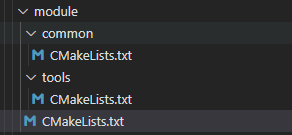

之前在开发过程中，对CMake基本就是一知半解，看现成的能看到，顺着现成的能写，但是很多比较细节的都不太清楚了，接着最近的积累，总结一下。

# CMake的开发流程
之前的一份工作是直接写makefile的，通过make来执行makefile。而CMake需要写CMakeLists.txt，相对makefile来说，CMakeLists.txt语法风格偏向C语言，虽然整体上还是有点晦涩，但是个人感觉阅读起来要简单一些。通过我们会先运行CMake命令，它就是依赖CMakeLists.txt执行，然后会自动生成makefile，接着再运行make就可以完成构建。
通过来说，我们的代码工程不止一个目录，每个层级都会有自己的CMakeLists.txt，上层的CMakeLists.txt通过add_subdirectory来包含下层的CMakeLists.txt。注意，add_subdirectory()的参数是相当于当前目录的目录名，对应的目录下必须要有CMakeLists.txt文件。
接下来我们来看一下我个人开发比较常用的CMakeLists.txt的基本内容，当然由于我目前的工作对CMake本身没有明确的规范限制，所以看起来并不太符合CMake的部分行为准则。
```C++
# 最低版本要求
cmake_minimum_required(VERSION 3.5)
# 指定工程名称
project(ota)
# 设置C和C++标准
set(CMAKE_S_STANDARD 99)
set(CMAKE_CXX_STANDARD 17)
# 启用大多数编译器警告信息, 启用一些-Wall没有包括的额外警告信息, 要求编译器遵循C或C++标准的严格语法和语义, 将所有告警视为error
add_compile_options(-Wall -Wextra -Wpedantic -Werror)
# 找对应的组件
find_package(Threads REQUIRED)
# 头文件路径包含
include_directories(XXX)
# 链接路径包含
link_directories(XXX)
# 源文件合集
file(GLOB_RECURSE ${PROJECT_NAME}_src *.cpp)
# 不建议使用aux_source_directory，file(GLOB)虽然也有局限性，不过一般情况也够用了
aux_source_directory(${CMAKE_CURRENT_SOURCE_DIR}/src/common COMMON_src)
# 编译可执行文件
add_executable(${PROJECT_NAME}, ${${PROJECT_NAME}_src})
target_link_diretories(${PROJECT_NAME} PUBLIC XXX1 XXX2)
target_link_libraries(${PROJECT_NAME}
    XXX_LIB1
    XXX_LIB2
    Threads::Threads
)
# 添加编译顺序依赖
add_dependencies(${PROJECT_NAME} XXX_OTHRER_TARGET)、
# install
install(TARGETS ${PROJECT_NAME}
    ARCHIVE DESTINATION XXX_DIR/lib/ COMPONENT some_release 
    LIBRARY DESTINATION XXX_DIR/lib/ COMPONENT some_release 
    RUNTIME DESTINATION XXX_DIR/bin/ COMPONENT some_release 
)
```

## CMake运行
运行cmake一般只需指定两个参数，CMakeLists.txt路径和构建路径，也就是build目录。比如运行我当前目录下的CMakeLists.txt，然后缓存输出到build目录下，
cmake -S . -B ./build/
运行完以后会生成Makefile，再执行make运行，也可以直接，
cmake --build ./build/
cmake --install ./build/
通过-D指定运行选项，比如最常用的Release和Debug，-DCMAKE_BUILD_TYPE=Release
打印每一行运行的cmake
cmake -S . -B ./build/ -DCMAKE_BUILD_TYPE=Release --trace
这样信息太多，也可以指定文件


## cmake_minimum_required和cmake_policy
这两个函数是比较常见的，前者在几乎所有的CMakeLists.txt文件中都会有，而后者不是很常用，前者就是所见即所得，没什么好说的，这里主要看一下后者的作用。
CMake每个版本都会引入新的策略，这些策略用CMPXXXX来表示，当我们使用了CMake新的语法，对应的cmake_minimum_required就需要指定好最低的版本要求。policy在官网可查询，https://cmake.org/cmake/help/latest/manual/cmake-policies.7.html
这个一个使用场景式，当指定了cmake_minimum_required以后，我们又想不改变最低版本号的情况下支持能够使用更高版本的特性，那么需要判断是否要设置该特性为NEW
cmake_minimum_required(VERSION 2.6)
if (POLICY CMP0048) 
    cmake_policy(SET CMP0048 NEW)
endif()

## 变量
变量非常常用，比如指定源文件，指定一些库之类的，最常见的就是通过SET来设置变量。
set(MY_VARIABLE "value")
set(MY_LIST "one" "two")
set(MY_LIST "one;two")

### 变量作用域
假设我们有这样一个CMake层级，

最外层CMakeLists.txt为，
```C++
project(module)
cmake_minimum_required(VERSION 3.5)
set(MY_VARIABLES "module")
message(STATUS "first print MY_VARIABLES : ${MY_VARIABLES}")
add_subdirectory(common)
message(STATUS "after common print MY_VARIABLES : ${MY_VARIABLES}")
add_subdirectory(tools)
```
内层分别为，
```C++
project(module)
cmake_minimum_required(VERSION 3.5)
message(STATUS "in common print MY_VARIABLES : ${MY_VARIABLES}")
set(MY_VARIABLES "common")
message(STATUS "in common after revise print MY_VARIABLES : ${MY_VARIABLES}")
```
```C++
project(module)
cmake_minimum_required(VERSION 3.5)
message(STATUS "in tools print MY_VARIABLES : ${MY_VARIABLES}")
set(MY_VARIABLES "tools")
message(STATUS "in tools after revise print MY_VARIABLES : ${MY_VARIABLES}")
```
运行以后发现打印为，
-- first print MY_VARIABLES : module
-- in common print MY_VARIABLES : module
-- in common after revise print MY_VARIABLES : common
-- after common print MY_VARIABLES : module
-- in tools print MY_VARIABLES : module
-- in tools after revise print MY_VARIABLES : tools
说明子目录可以读取父目录设置的变量，但是其修改时则会创建副本。


变量可以是一个列表，用;或者空格隔开，效果是一样的。
我们可以使用list追加变量，注意不是引用变量，而是直接使用变量名，因为引用变量就变成了变量所代表的值了
set(MY_VARIABLES "aaa")
list(APPEND MY_VARIABLES "bbbb")
