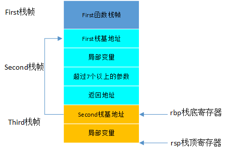

# 函数调用栈
在用户态中，程序的执行往往是一个函数调用另一个函数。函数调用都是通过栈来进行的，函数调用在汇编层面其实就是指令跳转，既然要跳转，就会涉及到参数和返回地址。  
在x86上，32位和64位函数调用栈在寄存器和布局上都是有所不同的，这里我主要以64位为主。  
栈顶指针寄存器：rsp  
栈基指针寄存器：rbp  
函数调用结果: rax  
函数调用时，前6个参数通过寄存器传递，其顺序为rdi、rsi、rdx、rcx、r8、r9，第7个及以后的参数通过栈进行传递。  
说实话，在网上一直没找到说的比较清楚的调用栈布局，反而是各种概念整的我迷迷糊糊。  
先简单梳理一下，  
1、每个函数栈帧的最底部放的是上一个栈帧的栈基地址，然后按照指令调用往下，入栈局部变量；  
2、当要调用下一个函数时，小于等于6个参数用寄存器传递，超出6个的参数入栈；  
3、每一次入栈都是移动当前的栈顶指针寄存器rsp，当前函数将返回地址入栈，也就是当前指令的下一行地址；  
4、调用下一个函数，首先将前一个函数栈帧的栈基地址入栈，当前的ebp就指向这个栈的位置，注意，这里相当于一个二级指针的关系。当前的ebp指向的是一个栈的地址，而这个栈里面存放的是上一个栈帧的栈基地址。要获取上一个栈帧的栈基地址也很简单，因为它就是ebp的旧值。  
5、之后就是当前函数的rsp移动扩展栈帧了。当前栈帧在使用寄存器时涉及到caller save/callee save，也就是寄存器的旧址保存和回复应该当前函数做还是他的上层函数做。而超过6个的参数入栈，也有一定规则，比如是从左到右还是从右到左。  
6、返回时，将返回值传到rax寄存器，恢复通用寄存器，恢复rsp和rbp，rbp显然是恢复成旧值，就是上一个栈帧的栈基地址，那么rsp恢复成什么呢，应该是返回地址所在栈地址，就是上面第3步放进去的
说这么多都是理论，我们实际来看一下，  
## 普通参数
```C++
int Second(int s1, int s2, int s3, int s4, int s5, int s6, int s7) {
    std::cout << "do nothing" << std::endl;
    return s1 + s2;
}
void First(int f1, int f2) {
    std::cout << "f1 : " << f1 << std::endl;
    std::cout << "f2 : " << f2 << std::endl;
    int s1 = f1;
    int s2 = f2;
    int s3 = 33;
    int s4 = 34;
    int s5 = 35;
    int s6 = 36;
    int s7 = 37;
    int res = Second(s1, s2, s3, s4, s5, s6, s7);
    std::cout << res << std::endl;
}
int main() {
    cout << "this is main start " << endl;
    int f1 = 11;
    int f2 = 12;
    First(11, 12);
    cout << "this is main end " << endl;
}
```
看一下main函数在调用First之前的几条汇编，
```bash
    0x000055555555535c <+55>:    movl   $0xb,-0x8(%rbp)
    0x0000555555555363 <+62>:    movl   $0xc,-0x4(%rbp)
    0x000055555555536a <+69>:    mov    $0xc,%esi
    0x000055555555536f <+74>:    mov    $0xb,%edi
    0x0000555555555374 <+79>:    callq  0x55555555521b <First(int, int)>
```
前面两条就是局部变量入栈，这里有点奇怪的是，先定义的变量居然是在后定义的变量的栈下面的，推测这也是一种规则。  
然后参数传递给esi和edi两个寄存器，这里就和前面看的对不上了，因为用的不是rsi和rdi。参数存入寄存器的顺序是从右往左，然后通过callq到下一个栈帧，callq指令的具体含义是：将当前指令的下一条指令的地址（即函数的起始地址）压入栈中，并跳转到该函数的入口地址执行。当函数执行完成后，会通过retq指令返回到调用者的下一条指令继续执行。  
```bash
=> 0x000055555555521b <+0>:     endbr64 
   0x000055555555521f <+4>:     push   %rbp                 前一个函数的栈基地址入栈
   0x0000555555555220 <+5>:     mov    %rsp,%rbp            更新栈基地址为当前栈帧栈顶
   0x0000555555555223 <+8>:     sub    $0x30,%rsp           移动rsp指针
   0x0000555555555227 <+12>:    mov    %edi,-0x24(%rbp)     edi寄存器中的值入栈
   0x000055555555522a <+15>:    mov    %esi,-0x28(%rbp)     esi寄存器中的值入栈
   ...中间的指令看不懂，省略了
   0x00005555555552a3 <+136>:   mov    -0x24(%rbp),%eax     f1的值放到eax中
   0x00005555555552a6 <+139>:   mov    %eax,-0x20(%rbp)     再从eax中入栈，在rbp-0x20的位置，这里应该是对应s1的定义
   0x00005555555552a9 <+142>:   mov    -0x28(%rbp),%eax     f2的值放到eax中
   0x00005555555552ac <+145>:   mov    %eax,-0x1c(%rbp)     再从eax中入栈，在rbp-0x1c的位置，这里应该是对应s2的定义
   0x00005555555552af <+148>:   movl   $0x21,-0x18(%rbp)        s3入栈，先定义的在下面
   0x00005555555552b6 <+155>:   movl   $0x22,-0x14(%rbp)        s4入栈
   0x00005555555552bd <+162>:   movl   $0x23,-0x10(%rbp)        s5入栈
   0x00005555555552c4 <+169>:   movl   $0x24,-0xc(%rbp)         s6入栈
   0x00005555555552cb <+176>:   movl   $0x25,-0x8(%rbp)         s7入栈
   0x00005555555552d2 <+183>:   mov    -0xc(%rbp),%r9d          s6存入r9
   0x00005555555552d6 <+187>:   mov    -0x10(%rbp),%r8d         s5存入r8
   0x00005555555552da <+191>:   mov    -0x14(%rbp),%ecx         s4存入ecx
   0x00005555555552dd <+194>:   mov    -0x18(%rbp),%edx         s3存入edx
   0x00005555555552e0 <+197>:   mov    -0x1c(%rbp),%esi         s2存入esi
   0x00005555555552e3 <+200>:   mov    -0x20(%rbp),%eax         把s1的值放到eax中
   0x00005555555552e6 <+203>:   sub    $0x8,%rsp                移动栈顶指针寄存器
   0x00005555555552ea <+207>:   mov    -0x8(%rbp),%edi          s7存入edi
   0x00005555555552ed <+210>:   push   %rdi                     rdi入栈，不知道为啥既有rdi又有edi
   0x00005555555552ee <+211>:   mov    %eax,%edi                eax放到edi中，应该是s1放到了edi中
   0x00005555555552f0 <+213>:   callq  0x5555555551c9 <Second(int, int, int, int, int, int, int)>
```
这里主要就是没看到第7个参数到低是怎么放的，于是我又增加几个参数，发现就是多了几条相似的指令，  
```bash
   0x00005555555552f8 <+221>:   mov    -0x8(%rbp),%edi
   0x00005555555552fb <+224>:   push   %rdi
   0x00005555555552fc <+225>:   mov    -0xc(%rbp),%edi
   0x00005555555552ff <+228>:   push   %rdi
   0x0000555555555300 <+229>:   mov    -0x10(%rbp),%edi
   0x0000555555555303 <+232>:   push   %rdi
```
说明mov和push这两步结合起来就是一个参数存入栈中的操作，说明多余的参数确实是放入栈中的。
然后来看函数调用返回的过程，可以看到，每一个传入的参数都会放入到当前函数的栈中
```bash
=> 0x00005555555551c9 <+0>:     endbr64 
   0x00005555555551cd <+4>:     push   %rbp
   0x00005555555551ce <+5>:     mov    %rsp,%rbp
   0x00005555555551d1 <+8>:     sub    $0x20,%rsp
   0x00005555555551d5 <+12>:    mov    %edi,-0x4(%rbp)
   0x00005555555551d8 <+15>:    mov    %esi,-0x8(%rbp)
   0x00005555555551db <+18>:    mov    %edx,-0xc(%rbp)
   0x00005555555551de <+21>:    mov    %ecx,-0x10(%rbp)
   0x00005555555551e1 <+24>:    mov    %r8d,-0x14(%rbp)
   0x00005555555551e5 <+28>:    mov    %r9d,-0x18(%rbp)
   0x00005555555551e9 <+32>:    lea    0xe1c(%rip),%rax        # 0x55555555600c
   0x00005555555551f0 <+39>:    mov    %rax,%rsi
   0x00005555555551f3 <+42>:    lea    0x2e46(%rip),%rax        # 0x555555558040 <_ZSt4cout@@GLIBCXX_3.4>
   0x00005555555551fa <+49>:    mov    %rax,%rdi
   0x00005555555551fd <+52>:    callq  0x5555555550a0 <_ZStlsISt11char_traitsIcEERSt13basic_ostreamIcT_ES5_PKc@plt>
   0x0000555555555202 <+57>:    mov    0x2dc7(%rip),%rdx        # 0x555555557fd0
   0x0000555555555209 <+64>:    mov    %rdx,%rsi
   0x000055555555520c <+67>:    mov    %rax,%rdi
   0x000055555555520f <+70>:    callq  0x5555555550b0 <_ZNSolsEPFRSoS_E@plt>
   0x0000555555555214 <+75>:    mov    -0x4(%rbp),%edx      //取出栈中局部变量放到edx中
   0x0000555555555217 <+78>:    mov    -0x8(%rbp),%eax      //取出栈中局部变量放到eax中
   0x000055555555521a <+81>:    add    %edx,%eax            //相加并将结果放到eax中
   0x000055555555521c <+83>:    leaveq 
   0x000055555555521d <+84>:    retq  
```
返回结果放到了eax寄存器，然后调用leaveq和retq，这两步是干什么呢？
leaveq相当于
```bash
    movq %rbp, %rsp     
    popq %rbp
```
即，rsp指向rbp，然后移动rbp出栈，此时将rsp的值赋给了rbp，rsp向栈底收缩，回想一下，此时它正好久指向了上一个函数栈帧中保存的返回值，此时相当于已经返回了上一个栈帧，但是指令寄存器中保存的地址还未更新。
然后retq相当于
```bash
    popq %rip
```
即rsp再移动，将弹出的返回地址保存到指令寄存器中，这样就完成了函数返回。

## 浮点参数
浮点数需要用到专门的寄存器xmm，这一块儿我之前也没了解过，暂时先不看了，感兴趣可以自己试试。

## 引用或者指针参数
将上面的First改成引用和指针参数，
```C++
void First(const int& f1, const int* f2) {
    std::cout << "f1 : " << f1 << std::endl;
    std::cout << "f2 : " << f2 << std::endl;
    int s1 = f1;
    int s2 = *f2;
    int s3 = 33;
    int s4 = 34;
    int s5 = 35;
    int s6 = 36;
    int s7 = 37;
    int res = Second(s1, s2, s3, s4, s5, s6, s7);
    std::cout << res << std::endl;
}

int main() {
    cout << "this is main start " << endl;
    int f1 = 11;
    int f2 = 12;
    First(f1, &f2);
    cout << "this is main end " << endl;
}
```
此时再查看汇编代码，
```bash
   0x00005555555553bb <+70>:    movl   $0xb,-0x10(%rbp)
   0x00005555555553c2 <+77>:    movl   $0xc,-0xc(%rbp)
   0x00005555555553c9 <+84>:    lea    -0xc(%rbp),%rdx
   0x00005555555553cd <+88>:    lea    -0x10(%rbp),%rax
   0x00005555555553d1 <+92>:    mov    %rdx,%rsi
   0x00005555555553d4 <+95>:    mov    %rax,%rdi
   0x00005555555553d7 <+98>:    callq  0x55555555525e <First(int const&, int const*)>
```
首先是局部变量f1和f2入栈，入栈顺序还是和定义顺序相反的。然后通过lea指令取地址，给到rdx和rax，再分别放到参数寄存器，所以和正常传参区别不大。

## 类型传参
```C++
struct A {
    int value;
};
class B {
public:
    B() = default;
private:
    int value;
};
void First(const B& b, A* a, const std::string& str) {

}
int main() {
    B b;
    A a;
    std::string str;
    First(b, &a, str);
    cout << "this is main end " << endl;
}
```
查看汇编的main函数栈帧，
```bash
=> 0x0000555555555240 <+0>:     endbr64 
   0x0000555555555244 <+4>:     push   %rbp
   0x0000555555555245 <+5>:     mov    %rsp,%rbp
   0x0000555555555248 <+8>:     push   %rbx
   0x0000555555555249 <+9>:     sub    $0x48,%rsp
   0x000055555555524d <+13>:    mov    %fs:0x28,%rax
   0x0000555555555256 <+22>:    mov    %rax,-0x18(%rbp)
   0x000055555555525a <+26>:    xor    %eax,%eax
   0x000055555555525c <+28>:    lea    -0x40(%rbp),%rax
   0x0000555555555260 <+32>:    mov    %rax,%rdi
   0x0000555555555263 <+35>:    callq  0x555555555110 <_ZNSt7__cxx1112basic_stringIcSt11char_traitsIcESaIcEEC1Ev@plt>
   0x0000555555555268 <+40>:    lea    -0x40(%rbp),%rdx
   0x000055555555526c <+44>:    lea    -0x44(%rbp),%rcx
   0x0000555555555270 <+48>:    lea    -0x48(%rbp),%rax
   0x0000555555555274 <+52>:    mov    %rcx,%rsi
   0x0000555555555277 <+55>:    mov    %rax,%rdi
   0x000055555555527a <+58>:    callq  0x555555555229 <First(B const&, A*, std::__cxx11::basic_string<char, std::char_traits<char>, std::allocator<char> > const&)>
```
先来看str的传参，str放到寄存器rdx中，我们看下它的构造，
lea    -0x40(%rbp),%rax
把这个地址放到了rax中，然后传参给rdi，然后调用构造函数，再这个地址上就得到了str这个变量
之后再取值放到了rdx中作为参数。另外两个参数直接入栈，可以看到并没有调用构造函数，也就是说编译器并不会为其生成构造函数。

最后，自己画个图来总结下x86_64的栈帧结构，  

