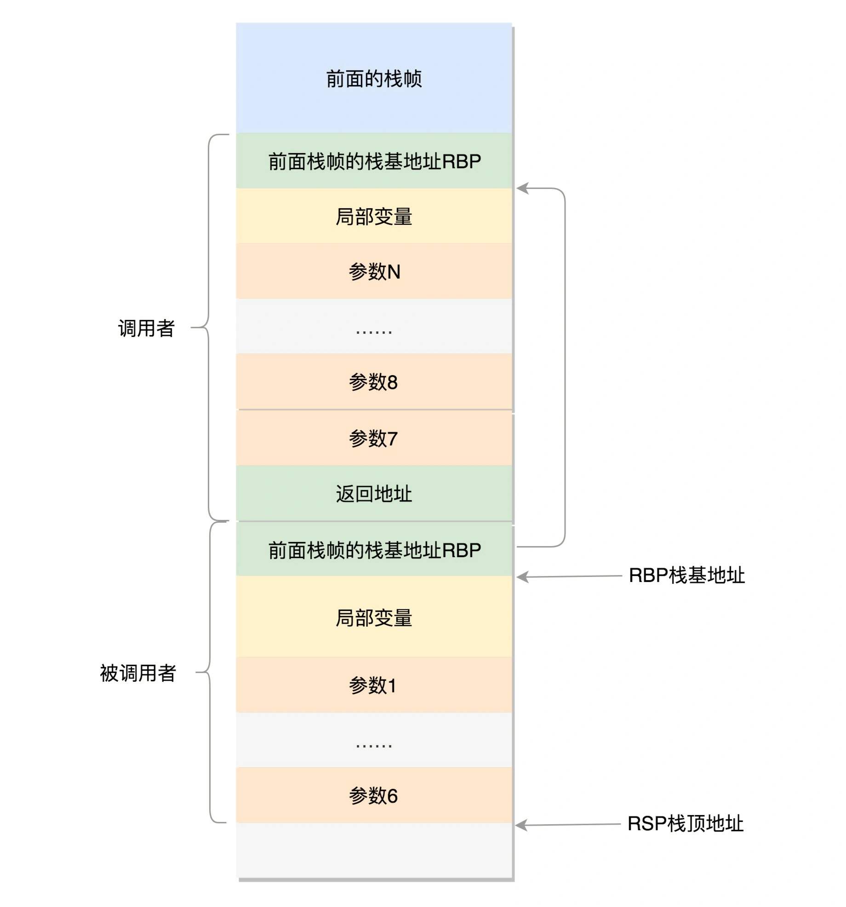

# 函数调用栈
在用户态中，程序的执行往往是一个函数调用另一个函数。函数调用都是通过栈来进行的，函数调用在汇编层面其实就是指令跳转，既然要跳转，就会涉及到参数和返回地址。  
在x86上，32位和64位函数调用栈在寄存器和布局上都是有所不同的，这里我主要以64位为主。  
栈顶指针寄存器：rsp  
栈基指针寄存器：rbp  
函数调用结果: rax  
函数调用时，前6个参数通过寄存器传递，其顺序为rdi、rsi、rdx、rcx、r8、r9，第7个及以后的参数通过栈进行传递。
说实话，在网上一直没找到说的比较清楚的调用栈布局，反而是各种概念整的我迷迷糊糊。

这张图，基本能说明，它下面的参数1~6放到了栈里面解释是说要寻址，我们简单理解一下，
1、每个函数栈帧的最底部放的是上一个栈帧的栈基地址，然后按照指令调用往下，入栈局部变量；
2、当要调用下一个函数时，小于等于6个参数用寄存器传递，超出6个的参数入栈；
3、每一次入栈都是移动当前的栈顶指针寄存器rsp，当前函数将返回地址入栈，也就是当前指令的下一行地址；
4、调用下一个函数，首先将前一个函数栈帧的栈基地址入栈，当前的ebp就指向这个栈的位置，注意，这里相当于一个二级指针的关系。当前的ebp指向的是一个栈的地址，而这个栈里面存放的是上一个栈帧的栈基地址。要获取上一个栈帧的栈基地址也很简单，因为它就是ebp的旧值。
5、之后就是当前函数的rsp移动扩展栈帧了。当前栈帧在使用寄存器时涉及到caller save/callee save，也就是寄存器的旧址保存和回复应该当前函数做还是他的上层函数做。而超过6个的参数入栈，也有一定规则，比如是从左到右还是从右到左。
6、返回时，将返回值传到rax寄存器，恢复通用寄存器，恢复rsp和rbp，rbp显然是回复成旧值，就是上一个栈帧的栈基地址，那么rsp恢复成什么呢，应该是返回地址所在栈地址，就是上面第3步放进去的
说这么多都是理论，我们实际来看一下，
```C++
int Second(int s1, int s2, int s3, int s4, int s5, int s6, int s7) {
    std::cout << "do nothing" << std::endl;
    return 999;
}
void First(int f1, int f2) {
    std::cout << "f1 : " << f1 << std::endl;
    std::cout << "f2 : " << f2 << std::endl;
    int s1 = f1;
    int s2 = f2;
    int s3 = 33;
    int s4 = 34;
    int s5 = 35;
    int s6 = 36;
    int s7 = 37;
    int res = Second(s1, s2, s3, s4, s5, s6, s7);
    std::cout << res << std::endl;
}
int main() {
    cout << "this is main start " << endl;
    int f1 = 11;
    int f2 = 12;
    First(11, 12);
    cout << "this is main end " << endl;
}
```
看一下main函数在调用First之前的几条汇编，
```C++
0x000055555555535c <+55>:    movl   $0xb,-0x8(%rbp)
0x0000555555555363 <+62>:    movl   $0xc,-0x4(%rbp)
0x000055555555536a <+69>:    mov    $0xc,%esi
0x000055555555536f <+74>:    mov    $0xb,%edi
0x0000555555555374 <+79>:    callq  0x55555555521b <First(int, int)>
```
前面两条就是局部变量入栈，这里有点奇怪的是，先定义的变量居然是在后定义的变量的栈下面的，推测这也是一种规则。
然后参数传递给esi和edi两个寄存器，这里就和前面看的对不上了，因为用的不是rsi和rdi。参数存入寄存器的顺序是从右往左，然后通过callq到下一个栈帧，callq指令的具体含义是：将当前指令的下一条指令的地址（即函数的起始地址）压入栈中，并跳转到该函数的入口地址执行。当函数执行完成后，会通过retq指令返回到调用者的下一条指令继续执行。
```C++
=> 0x000055555555521b <+0>:     endbr64 
   0x000055555555521f <+4>:     push   %rbp                 前一个函数的栈基地址入栈
   0x0000555555555220 <+5>:     mov    %rsp,%rbp            更新栈基地址为当前栈帧栈顶
   0x0000555555555223 <+8>:     sub    $0x30,%rsp           移动rsp指针
   0x0000555555555227 <+12>:    mov    %edi,-0x24(%rbp)     edi寄存器中的值入栈
   0x000055555555522a <+15>:    mov    %esi,-0x28(%rbp)     esi寄存器中的值入栈
   ...中间的指令看不懂，省略了
   0x00005555555552a3 <+136>:   mov    -0x24(%rbp),%eax     f1的值放到eax中
   0x00005555555552a6 <+139>:   mov    %eax,-0x20(%rbp)     再从eax中入栈，在rbp-0x20的位置，这里应该是对应s1的定义
   0x00005555555552a9 <+142>:   mov    -0x28(%rbp),%eax     f2的值放到eax中
   0x00005555555552ac <+145>:   mov    %eax,-0x1c(%rbp)     再从eax中入栈，在rbp-0x1c的位置，这里应该是对应s2的定义
   0x00005555555552af <+148>:   movl   $0x21,-0x18(%rbp)        s3入栈，先定义的在下面
   0x00005555555552b6 <+155>:   movl   $0x22,-0x14(%rbp)        s4入栈
   0x00005555555552bd <+162>:   movl   $0x23,-0x10(%rbp)        s5入栈
   0x00005555555552c4 <+169>:   movl   $0x24,-0xc(%rbp)         s6入栈
   0x00005555555552cb <+176>:   movl   $0x25,-0x8(%rbp)         s7入栈
   0x00005555555552d2 <+183>:   mov    -0xc(%rbp),%r9d          s6存入r9
   0x00005555555552d6 <+187>:   mov    -0x10(%rbp),%r8d         s5存入r8
   0x00005555555552da <+191>:   mov    -0x14(%rbp),%ecx         s4存入ecx
   0x00005555555552dd <+194>:   mov    -0x18(%rbp),%edx         s3存入edx
   0x00005555555552e0 <+197>:   mov    -0x1c(%rbp),%esi         s2存入esi
   0x00005555555552e3 <+200>:   mov    -0x20(%rbp),%eax         把s1的值放到eax中
   0x00005555555552e6 <+203>:   sub    $0x8,%rsp                移动栈顶指针寄存器
   0x00005555555552ea <+207>:   mov    -0x8(%rbp),%edi          s7存入edi
   0x00005555555552ed <+210>:   push   %rdi                     rdi入栈，不知道为啥既有rdi又有edi
   0x00005555555552ee <+211>:   mov    %eax,%edi                eax放到edi中，应该是s1放到了edi中
   0x00005555555552f0 <+213>:   callq  0x5555555551c9 <Second(int, int, int, int, int, int, int)>
```
这里主要就是没看到第7个参数到低是怎么放的，于是我又增加几个参数，发现就是多了几条相似的指令，
```C++
   0x00005555555552f8 <+221>:   mov    -0x8(%rbp),%edi
   0x00005555555552fb <+224>:   push   %rdi
   0x00005555555552fc <+225>:   mov    -0xc(%rbp),%edi
   0x00005555555552ff <+228>:   push   %rdi
   0x0000555555555300 <+229>:   mov    -0x10(%rbp),%edi
   0x0000555555555303 <+232>:   push   %rdi
```
说明mov和push这两步结合起来就是一个参数存入栈中的操作。


