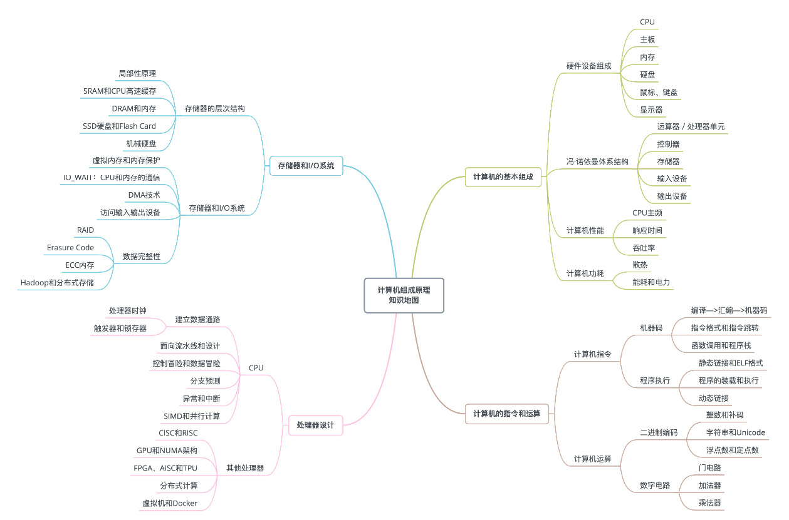

以前对计算机组成没什么概率，也觉得没啥用，后来随着认知的积累，发现了解基本的计组还是很重要的，不然平时听到别人说什么缓存、流水线可能都不知道是什么意思。
学习计算机组成原理，重点就是了解运算器和控制器的工作原理，我们写的代码是如何变成机器指令并被CPU运行的，学习内存的工作原理，以及在日常开发中需要注意的。我个人更多还是关注上层抽象部分，不会过多关注硬件电路原理（我真的害怕数电和模电）。
  

## 冯·诺依曼体系结构
也叫存储程序计算机，说明了一台计算机的组成部分为：
1. 包括算术逻辑单元(ALU)和处理器寄存器的处理器单元，也就是运算器；
2. 包含指令寄存器和程序计数器的控制器单元，也就是控制器；
3. 存储数据和指令的内存已经更大容量的外部存储，也就是存储器；
4. 输入输出设备
现代计算机都是这个架构，即从输入设备读取输入信息，通过运算器和控制器来执行存储器中的程序，最终输出到输出设备中。

## 南桥和北桥
南桥连接鼠标、键盘以及硬盘这些外部设备和 CPU 之间的通信， 北桥连接 CPU 和内存、显卡之间的通信，不过现在的北桥都集成到了cpu的内部。主板的芯片组（Chipset）和总线（Bus）解决了 CPU 和内存之间如何通信的问题。芯片组控制了数据传输的流转，也就是数据从哪里到哪里的问题。总线则是实际数据传输的高速公路。

## soc
我们手机里只有 SD 卡（Secure Digital Memory Card）这样类似硬盘功能的存储卡插槽，并没有内存插槽、CPU 插槽这些东西。没错，因为手机尺寸的原因，手机制造商们选择把 CPU、内存、网络通信，乃至摄像头芯片，都封装到一个芯片，然后再嵌入到手机主板上。这种方式叫SoC，也就是 System on a Chip（系统芯片）。

## 主频
CPU内部晶体整荡器的速度，每震荡一次就代表一个时钟周期，我们可以简单的认为一个时钟周期就会执行一条简单的指令，主频越高，理论上1s内能执行的指令就越多。
CPU的执行时间 = 指令数 * 每条指令的平均时钟周期数 * 时钟周期时间
要优化性能其实就是减少执行时间，时钟周期时间就是由主频决定。那为什么主频不能无限增加呢，因为主频越高功耗也会越高。

