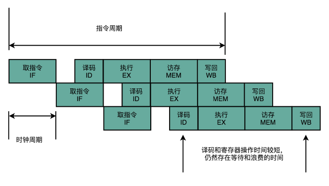
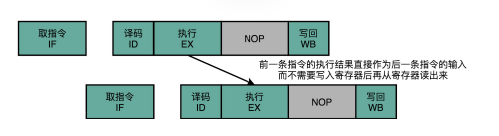

# CPU中的指令周期、CPU周期和时钟周期
指令周期
计算机每执行一条指令的过程，可以分解成这样几个步骤，
取址：从PC 寄存器里找到对应的指令地址，根据指令地址从内存里把具体的指令，加载到指令寄存器中，然后把 PC 寄存器自增，好在未来执行下一条指令；
译码：根据指令寄存器里面的指令，解析成要进行什么样的操作，具体要操作哪些寄存器、数据或者内存地址；
执行：算术逻辑单元ALU执行指令指明的操作，执行算术逻辑操作、数据传输或者地址跳转；
这样的执行执行步骤循环就是指令周期，实际上后面还有访存和写回阶段，不过我们也可以把执行、访存和写回都看成是执行阶段，而PC寄存器的修改可能是发生在取址阶段，也可能是访存之后。

CPU周期
CPU 内部的操作速度很快，但是访问内存的速度却要慢很多。每一条指令都需要从内存里面加载而来，所以我们一般把从内存里面读取一条指令的最短时间，称为 CPU 周期，也叫机器周期。

时钟周期
时钟周期就是主频的倒数，一个CPU周期会包含多个时钟周期。对于一个指令周期来说，我们取出一条指令，然后执行它，至少需要两个 CPU 周期。取出指令至少需要一个 CPU 周期，执行至少也需要一个 CPU 周期，复杂的指令则需要更多的 CPU 周期。而一个CPU周期是若干时钟周期之和。

取值和译码这两个阶段是由控制器来完成的，所有 CPU 支持的指令，都会在控制器里面，被解析成不同的输出信号输送给运算器，告诉运算器完成不同的运算。
CPU的硬件电路其实就是包含这几个部分：
运算器ALU，它实际就是一个没有状态的，根据输入计算输出结果的一个电路；
寄存器，进行状态读写的电路元件，可以存储上一次的计算结果，在需要的时候拿出来用；
指令周期执行，一个“自动”的电路，按照固定的周期，不停地实现 PC 寄存器自增，自动地去执行“Fetch - Decode - Execute“的步骤；
译码电路，无论是对于指令进行 decode，还是对于拿到的内存地址去获取对应的数据或者指令，我们都需要通过一个电路找到对应的数据。

给定输入，就能得到固定的输出。这样的电路，我们称之为组合逻辑电路。而时序电路在任一时刻的输出信号不仅与当时的输入信号有关，而且与电路原来的状态有关。CPU中要实现时序逻辑电路，需要一个时钟信号，这个时钟信号就是晶体振荡器生成的电路信号。

# CPU流水线
假设每一条指令，从程序计数，到获取指令、执行指令，都在一个时钟周期内完成，那么此时的时钟周期就要向最复杂指令看齐，主频不能太高，因为如果时钟周期太短，那么一条指令还没执行完，后一条指令就开始进行了。而这样设计，又会导致调用简单指令时存在巨大的浪费。我们通常称时钟周期，可以认为是完成一条简单指令的时间，但是这里明显矛盾了，因为我们得按照复杂指令来完成时间来定啊。实际上，现代CPU都使用了一种叫做指令流水线的技术。

CPU流水线技术是一种将指令分解为多步，并让不同指令的各步操作重叠，从而实现几条指令并行处理，以加速程序运行过程的技术。指令的每步有各自独立的电路来处理，每完成一步，就进到下一步，而前一步则处理后续指令，属于CPU硬件电路层面的并发。这样一来，我们就不用把时钟周期设置成整条指令执行的时间，而是拆分成完成这样的一个一个小步骤需要的时间。流水线结构下，每一个阶段的电路在完成对应的任务之后，也不需要等待整个指令执行完成，而是可以直接在下一个时钟周期执行下一条指令的对应阶段。
根据拆分的步数，区分流水线的级数，比如上面的取指-->译码-->执行-->访存-->写回就是五级流水线。
五级的流水线，就表示我们在同一个时钟周期里面，同时运行五条指令的不同阶段。这个时候，虽然执行一条指令的时钟周期变成了 5，但是我们可以把 CPU 的主频提得更高了。我们不需要确保最复杂的那条指令在时钟周期里面执行完成，而只要保障一个最复杂的流水线级的操作，在一个时钟周期内完成就好了。
如果某一个操作步骤的时间太长，我们就可以考虑把这个步骤，拆分成更多的步骤，让所有步骤需要执行的时间尽量都差不多长。这样，也就可以解决我们在单指令周期处理器中遇到的，性能瓶颈来自于最复杂的指令的问题。像我们现代的 ARM 或者 Intel 的 CPU，流水线级数都已经到了 14 级。
我们需要明确的是，流水线并不是缩短了计算时间，而是提高了吞吐量。那为什么流水线级数不能无限增加呢，这是因为每一级流水线对应的输出，都要放到流水线寄存器，然后在下一个时钟周期，交给下一个流水线级去处理。每增加一级的流水线，就要多一级写入到流水线寄存器的操作，尽快这个操作可以很快，但是，如果我们不断加深流水线，这些操作占整个指令的执行时间的比例就会不断增加。最后，我们的性能瓶颈就会出现在这些 overhead 上（还会有其他的影响）。且提升流水线层级，要保证在相同的时间内完成一条指令的所有stage，意味着主频必须跟着提升，且所需电路晶体管变多，功耗就会变大。

# 冒险问题
在上面说到的流水线执行，我们都是假设每一条流水线执行的指令都是相互独立的，然而实际上却并非总是如此，后续指令往往会依赖前面指令的执行结果，这个依赖问题就是CPU中的冒险问题。
冒险分为数据冒险、控制冒险和结构冒险，也可以称为流水线冲突。
## 数据冒险
数据冒险就是多个指令之间有数据依赖，包括先写后读（数据依赖），先读后写（反依赖），写后再写（输出依赖）。
解决数据冒险最简单的做法是流水线停顿，或者叫流水线冒泡。

冒泡会导致cpu空转，所以还有一种做法是操作数旁推。通过在硬件层面制造一条旁路，让一条指令的计算结果，可以直接传输给下一条指令，而不再需要“指令 1 写回寄存器，指令 2 再读取寄存器“这样多此一举的操作。这样直接传输带来的好处就是，后面的指令可以减少，甚至消除原本需要通过流水线停顿，才能解决的数据冒险问题。
比如下图在第一条指令的执行阶段完成之后，直接将结果数据传输给到下一条指令的 ALU。然后，下一条指令不需要再插入两个 NOP 阶段，就可以继续正常走到执行阶段。

操作数前推可以和冒泡一起使用，减少时钟周期流水线的空转。

无论是流水线冒泡还是操作数前推都还伴随着插入nop的操作，导致指令停顿。流水线还有另外一种优化，乱序执行。
a = b + c;
d = a * e;
x = y * z;
比如这里，第二条指令依赖第一条指令，但是第三条指令并不依赖前面两条指令，因此不需要等前面两条指令执行完成。
乱序执行使得CPU的流水线不再是上面看到的简单流程了，主要是在指令执行阶段，称为多发射

1. 在取指令和指令译码的时候，乱序执行的 CPU 和其他使用流水线架构的 CPU 是一样的。它会一级一级顺序地进行取指令和指令译码的工作。  
2. 在指令译码完成之后，就不一样了。CPU 不会直接进行指令执行，而是进行一次指令分发，把指令发到一个叫作保留站（Reservation Stations）的地方。顾名思义，这个保留站，就像一个火车站一样。发送到车站的指令，就像是一列列的火车。
3. 这些指令不会立刻执行，而要等待它们所依赖的数据，传递给它们之后才会执行。这就好像一列列的火车都要等到乘客来齐了才能出发。
4. 一旦指令依赖的数据来齐了，指令就可以交到后面的功能单元（Function Unit，FU），其实就是 ALU，去执行了。我们有很多功能单元可以并行运行，但是不同的功能单元能够支持执行的指令并不相同。就和我们的铁轨一样，有些从上海北上，可以到北京和哈尔滨；有些是南下的，可以到广州和深圳。
5. 指令执行的阶段完成之后，我们并不能立刻把结果写回到寄存器里面去，而是把结果再存放到一个叫作重排序缓冲区（Re-Order Buffer，ROB）的地方。
6. 在重排序缓冲区里，我们的 CPU 会按照取指令的顺序，对指令的计算结果重新排序。只有排在前面的指令都已经完成了，才会提交指令，完成整个指令的运算结果。
7. 实际的指令的计算结果数据，并不是直接写到内存或者高速缓存里，而是先写入存储缓冲区（Store Buffer 面，最终才会写入到高速缓存和内存里。
可以看到，在乱序执行的情况下，只有 CPU 内部指令的执行层面，可能是“乱序”的。只要我们能在指令的译码阶段正确地分析出指令之间的数据依赖关系，这个“乱序”就只会在互相没有影响的指令之间发生。
即便指令的执行过程中是乱序的，我们在最终指令的计算结果写入到寄存器和内存之前，依然会进行一次排序，以确保所有指令在外部看来仍然是有序完成的。
在现代 Intel 的 CPU 的乱序执行的过程中，只有指令的执行阶段是乱序的，后面的内存访问和数据写回阶段都仍然是顺序的。这种保障内存数据访问顺序的模型，叫作强内存模型（Strong Memory Model）。

## 控制冒险
控制冒险是指为了确保能取到正确的指令，而不得不进行等待延迟的情景就是。例如跳转指令的（顺序）下一条指令是否应当执行，只有等到跳转指令指令执行完（流水线停顿），更新了PC寄存器，才能确定。
在结构冒险和数据冒险中，你会发现，所有的流水线停顿操作都要从指令执行阶段开始。流水线的前两个阶段，也就是取指令（IF）和指令译码（ID）的阶段，是不需要停顿的。CPU 会在流水线里面直接去取下一条指令，然后进行译码。取指令和指令译码不会需要遇到任何停顿，这是基于一个假设。这个假设就是，所有的指令代码都是顺序加载执行的。不过这个假设，在执行的代码中，一旦遇到 if…else 这样的条件分支，或者 for/while 循环，就会不成立。
比如对于cmp 比较指令、jmp 和jne 这样的条件跳转指令。在 jmp 指令发生的时候，CPU 可能会跳转去执行其他指令。jmp 后的那一条指令是否应该顺序加载执行，在流水线里面进行取指令的时候，我们没法知道。要等 jmp 指令执行完成，去更新了 PC寄存器之后，我们才能知道，是否执行下一条指令，还是跳转到另外一个内存地址，去取别的指令。
为了减少这种控制冒险带来的等待，第一个方法是 缩短分支延迟。
条件跳转指令其实进行了两种电路操作，第一种，是进行条件比较。这个条件比较，需要的输入是，根据指令的 opcode，就能确认的条件码寄存器。第二种，是进行实际的跳转，也就是把要跳转的地址信息写入到 PC 寄存器。无论是 opcode，还是对应的条件码寄存器，还是我们跳转的地址，都是在指令译码（ID）的阶段就能获得的。而对应的条件码比较的电路，只要是简单的逻辑门电路就可以了，并不需要一个完整而复杂的 ALU。所以，我们可以将条件判断、地址跳转，都提前到指令译码阶段进行，而不需要放在指令执行阶段。对应的，我们也要在 CPU 里面设计对应的旁路，在指令译码阶段，就提供对应的判断比较的电路。这种方式，本质上和前面数据冒险的操作数前推的解决方案类似，就是在硬件电路层面，把一些计算结果更早地反馈到流水线中。这样反馈变得更快了，后面的指令需要等待的时间就变短了。
不过只是改造硬件，并不能彻底解决问题。跳转指令的比较结果，仍然要在指令执行的时候才能知道。在流水线里，第一条指令进行指令译码的时钟周期里，我们其实就要去取下一条指令了。这个时候，我们其实还没有开始指令执行阶段，自然也就不知道比较的结果。
所以，主要依赖的还是另外一种方法 分支预测。
最简单的分支预测技术，叫作“假装分支不发生”。顾名思义，自然就是仍然按照顺序，把指令往下执行。其实就是CPU 预测，条件跳转一定不发生。这样的预测方法，其实也是一种静态预测技术。就好像猜硬币的时候，你一直猜正面，会有 50% 的正确率。如果分支预测是正确的，我们自然赚到了。这个意味着，我们节省下来本来需要停顿下来等待的时间。如果分支预测失败了呢？那我们就把后面已经取出指令已经执行的部分，给丢弃掉。这个丢弃的操作，在流水线里面，叫作 Zap 或者Flush。CPU 不仅要执行后面的指令，对于这些已经在流水线里面执行到一半的指令，我们还需要做对应的清除操作。比如，清空已经使用的寄存器里面的数据等等，这些清除操作，也有一定的开销。所以，CPU 需要提供对应的丢弃指令的功能，通过控制信号清除掉已经在流水线中执行的指令。只要对应的清除开销不要太大，我们就是划得来的。
这样一来，CPU 会根据分支预测的结果，选择下一条指令进入流水线。待跳转指令执行完成，如果预测正确，则流水线继续执行，不会受到跳转指令的影响。如果分支预测失败，那么便需要清空流水线，重新加载正确的分支。

静态分支预测准确率太低了，所以我们需要动态分支预测，比如根据之前条件跳转的比较结果来预测。比如用一个比特，去记录当前分支的比较情况，直接用当前分支的比较情况，来预测下一次分支时候的比较情况，这种就是1bit动态分支预测，还有n bit动态分支预测。当然实际上，现代CPU分支预测是比较复杂的。
https://en.wikipedia.org/wiki/Branch_predictor

## 结构冒险
结构冒险是指在同一个时钟周期的两个流水线的不同阶段依赖了同一个硬件电路。解决结构冒险通常要增加资源，比如现代CPU都将高速缓存拆分成了数据缓存和指令缓存，避免取指令和数据访问冲突。上面数据保险中说的插入nop也可以用来做指令对齐，避免两条指令在同一个时钟周期使用相同的硬件资源。

