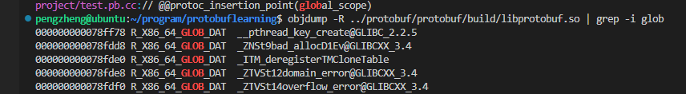

# 动态链接
在日常开发工作中，动态链接我接触的更多，比如作为基础平台，我们平时都是提供动态库和接口头文件给其他业务组使用。动态链接相比静态链接最大的好处就是节省空间了，链接过程推迟到运行时再进行，由动态链接器完成，相比静态链接有一定性能损失，但是较小。  
动态链接库在链接阶段也要使用，因为链接器必须确定目标文件中引用的符号是需要按照静态链接的规则来重定位还是留到装载的时候进行。动态库中就保留了这些符号信息，所以正常编译时，也是需要能找到动态库的。通常来说，我们编译动态库都会加上-fPIC，这个命令具体是啥意思呢？我们就从这个开始了解。  

## 地址无关
使用readelf -l 查看可执行文件的装载视图，可以发现其装载地址不是从0开始的  
  
而如果查看动态库的装载视图，装载地址是从地址0开始的，因为装载地址在编译阶段是不确定的，必须要装载时才能确定。  
  
由于在装载时，并不能知道动态库会加载到进程虚拟内存空间的哪个位置，所以动态库中的绝对地址引用都需要在装载时重新定位，但是又不能简单的修改指令地址，因为动态库指令部分是多个进程共享的，不同进程指令地址是不一样的。如何做到共享的指令部分不需要因为装载地址变化而改变呢，这就是地址无关pic。  
其实地址无关不是啥高深的方法，只是将需要修改的部分分离出来和数据部分放到一起，创建一个副本。动态库中的地址引用分为跨模块和模块内，同时分为指令引用和数据访问，对应的就有始终情况。  
> 模块内部的调用或者跳转   

被调用者与调用者处于同一模块，相对位置是固定的，不需要修正重定位。只要采用相对地址调用，它就是地址无关的，但是存在全局符号介入的问题。  

> 模块内部的数据访问  

一个模块前面一般是若干个页的代码，后面紧跟着若干个页的数据，这些页之间的相对位置是固定的，指令和它需要访问的模块内部的数据之间的相对位置是固定的。数据的相对寻址没有相对于当前指令PC的寻址，所以需要先获取当前的PC值然后再加上一个偏移量。  

> 模块间的数据访问  

模块间的数据访问目标地址要等到装载时才能确定，要想做到地址代码无关，就要像前面说的一样，需要将地址相关的部分放到数据段。这个就是大名鼎鼎的GOT，全局偏移表了。  
动态库A要访问动态库B或者可执行文件中的变量b，会先访问GOT，然后根据GOT中的项找到变量的地址，每个变量的地址都是4个字节的，链接器在装载动态库时会填充GOT中的项，而GOT就是放到数据段，是一个单独的section。  
objdump -R 动态库可以查看需要动态链接重定位的信息    
  

> 模块间的调用或者跳转  

模板间的调用和跳转和上面的类型差不多，也是要用到GOT，只不过GOT里面存放的是目标函数的地址了。  

## 全局变量引用问题
由于在使用模块内的全局变量时，无法确认是否为跨模块调用，所以都要当成跨模块调用，在装载的时候再把GOT中的地址修正为实际的地址，它可能指向可执行文件中，也可能指向模块内部或者其他的动态库中。  

## 延迟绑定plt
为了加快动态链接程序的启动速度，尽量减少启动时的符号查找和重定位，ELF采用了延迟绑定，也就是只有当函数第一次被用到才会进行绑定，也就是符号查找和重定位，注意只有对函数引用才有这个延迟绑定。  
（1）首先，ELF将GOT拆分成.got和.got.plt，前者用来保存全局变量引用的地址，后者用来保存函数引用的地址，这两者都还是数据段。    
（2）plt是一个单独的段.plt，本身都是地址无关的，会放到代码段。plt每一项都是一小段代码，比如func这个函数，就有func@plt这个plt项，其指令是，     
jmp *(func@GOT)  
push n  
push moduleID  
jump _dl_runtime_resolve  
如果不考虑延迟绑定，引用函数时，跳转到对应plt项，然后再跳转到func@GOT，也就是.got.plt中对应的项就获取到真实的函数地址了。那么为了做延迟绑定，我们就需要计算机科学中的这个万能的中间层。
首先，刚装载时，不会直接将函数引用地址填充到.got.plt中，而是将.plt对应表项中的“push n”这条指令的地址放进去，所以第一次调用就是会走到这个指令，这条指令中n是指func这个符号在.rel.plt中的下标，
.rel.plt是保存了重定位的信息，也就是需要延迟绑定的符号，动态链接函数就是根据这个id获取要重定位的函数。  
然后，下一条指令是将模块ID压入堆栈，最后一条就是调用动态链接器的函数赖完成符号解析和重定位，完成以后就会放到func@GOT中，也就是.got.plt对应表中，下一次走到plt中就会直接访问到正确的.got.plt中的地址了。   
（3）.got.plt中的前三项有特殊的含义，第一项保存的是.dynamic段的地址，第二项保存的是本模块的ID，第三项保存的是_dl_runtime_resolve()的地址，这个函数就是动态链接器中用来在运行时完成地址绑定的工作。  
后面两项是在装载时由动态库链接器来完成初始化，其余项就是外部函数的引用地址了。  
所以，实际的plt会简化成，  
jmp *(func@GOT)  
push n  
jump PLT0  
而PLT0是作为一个公共代码段，里面的指令正好是  
push *(GOT+4)  
jump *(GOT+8)  

结合这张图来理解    
  
首先plt表的第一项plt[0]是作为一个公共项，里面会保存两个内容，第一个就是 “push moduleID”，第二个就是“jump 地址”  
这个地址是.got.plt表的第三项got[2]的地址，这个地址初始时0，进程装载时动态链接器将其初始化为_dl_runtime_resolve()的地址，注意哈，是初始化.got.plt中的保存的地址，不是.plt的地址。  
所以就是：  
plt[0]:  
	push *(GOT+4)  
	jump *(GOT+8)  
当第一次调用一个函数puts时，跳转到puts@plt这个表项的地址，然后执行第一个指令jmp *(puts@GOT)，也就是got表中的puts项，但是这个一开始初始化的值并不是puts函数地址，而是puts@plt这个表的第二个指令的地址，push n，  
这条指令中n是指puts这个符号在.rel.plt中的下标，用来告诉_dl_runtime_resolve()要重定位哪个函数。然后接着执行下面一条指令就是jmp plt[0]。当跳到plt[0]就会最终调用got[2]中存的_dl_runtime_resolve()完成puts的重定位，并将重定位地址存放到puts@GOT中。  
当重定位完成以后，下一次再过来，就直接走到puts@GOT中，此时里面存放的就是puts的实际地址了。  
  

## 实例分析-主程序依赖动态库
只是看了上面的原理分析，实际上我个人还是有点糊涂的。举个简单的例子，当一个进程需要依赖一个动态库的函数时，主程序的.plt中应该有这个函数对应的表项，处于代码段。plt中会跳转.got.plt，那么.got.plt又属于主程序还是动态库呢？我们来写个例子看一下，  
首先，主程序里面调用Upgrade这个函数  
```C++
extern void Upgrade();
extern int kNumsTotal;
int main() {
    cout << "this is main start " << endl;
    Upgrade();
    std::cout << kNumsTotal << endl;
    cout << "this is main end " << endl;
}
```
动态库里面实现Upgrade这个函数，将其编译为libflag.so  
```C++
int kNumsTotal = 666;
void Upgrade() {
    std::cout << "this is upgrade in shared" << std::endl;
}
```
然后编译完，看主程序里面的依赖，libflag.so => ./libflag.so (0x00007f382978b000)  
查看主程序中的重定位相关信息，readelf -r main  
```bash
重定位节 '.rela.dyn' at offset 0x740 contains 13 entries:
  偏移量          信息           类型           符号值        符号名称 + 加数
000000003d58  000000000008 R_X86_64_RELATIVE                    11e0
000000003d60  000000000008 R_X86_64_RELATIVE                    12d2
000000003d68  000000000008 R_X86_64_RELATIVE                    11a0
000000004008  000000000008 R_X86_64_RELATIVE                    4008
000000003fc8  000d00000006 R_X86_64_GLOB_DAT 0000000000000000 __cxa_finalize@GLIBC_2.2.5 + 0
000000003fd0  000100000006 R_X86_64_GLOB_DAT 0000000000000000 _ZSt4endlIcSt11char_tr@GLIBCXX_3.4 + 0
000000003fd8  000800000006 R_X86_64_GLOB_DAT 0000000000000000 _ITM_deregisterTMClone + 0
000000003fe0  000900000006 R_X86_64_GLOB_DAT 0000000000000000 __libc_start_main@GLIBC_2.2.5 + 0
000000003fe8  000a00000006 R_X86_64_GLOB_DAT 0000000000000000 __gmon_start__ + 0
000000003ff0  000b00000006 R_X86_64_GLOB_DAT 0000000000000000 _ITM_registerTMCloneTa + 0
000000003ff8  000c00000006 R_X86_64_GLOB_DAT 0000000000000000 _ZNSt8ios_base4InitD1E@GLIBCXX_3.4 + 0
000000004040  000f00000005 R_X86_64_COPY     0000000000004040 _ZSt4cout@GLIBCXX_3.4 + 0
000000004150  000e00000005 R_X86_64_COPY     0000000000004150 kNumsTotal + 0

重定位节 '.rela.plt' at offset 0x878 contains 6 entries:
  偏移量          信息           类型           符号值        符号名称 + 加数
000000003f98  000200000007 R_X86_64_JUMP_SLO 0000000000000000 _Z7Upgradev + 0
000000003fa0  000300000007 R_X86_64_JUMP_SLO 0000000000000000 __cxa_atexit@GLIBC_2.2.5 + 0
000000003fa8  000400000007 R_X86_64_JUMP_SLO 0000000000000000 _ZStlsISt11char_traits@GLIBCXX_3.4 + 0
000000003fb0  000500000007 R_X86_64_JUMP_SLO 0000000000000000 _ZNSolsEPFRSoS_E@GLIBCXX_3.4 + 0
000000003fb8  000600000007 R_X86_64_JUMP_SLO 0000000000000000 _ZNSt8ios_base4InitC1E@GLIBCXX_3.4 + 0
000000003fc0  000700000007 R_X86_64_JUMP_SLO 0000000000000000 _ZNSolsEi@GLIBCXX_3.4 + 0
```
对于动态链接信息，我们可以直接通过objdump -T main查看动态库链接符号，通过objdump -R main查看动态库链接重定位信息
```bash
DYNAMIC RELOCATION RECORDS
OFFSET           TYPE              VALUE 
0000000000003d58 R_X86_64_RELATIVE  *ABS*+0x00000000000011e0
0000000000003d60 R_X86_64_RELATIVE  *ABS*+0x00000000000012d2
0000000000003d68 R_X86_64_RELATIVE  *ABS*+0x00000000000011a0
0000000000004008 R_X86_64_RELATIVE  *ABS*+0x0000000000004008
0000000000003fc8 R_X86_64_GLOB_DAT  __cxa_finalize@GLIBC_2.2.5
0000000000003fd0 R_X86_64_GLOB_DAT  _ZSt4endlIcSt11char_traitsIcEERSt13basic_ostreamIT_T0_ES6_@GLIBCXX_3.4
0000000000003fd8 R_X86_64_GLOB_DAT  _ITM_deregisterTMCloneTable
0000000000003fe0 R_X86_64_GLOB_DAT  __libc_start_main@GLIBC_2.2.5
0000000000003fe8 R_X86_64_GLOB_DAT  __gmon_start__
0000000000003ff0 R_X86_64_GLOB_DAT  _ITM_registerTMCloneTable
0000000000003ff8 R_X86_64_GLOB_DAT  _ZNSt8ios_base4InitD1Ev@GLIBCXX_3.4
0000000000004040 R_X86_64_COPY     _ZSt4cout@@GLIBCXX_3.4
0000000000004150 R_X86_64_COPY     kNumsTotal
0000000000003f98 R_X86_64_JUMP_SLOT  _Z7Upgradev
0000000000003fa0 R_X86_64_JUMP_SLOT  __cxa_atexit@GLIBC_2.2.5
0000000000003fa8 R_X86_64_JUMP_SLOT  _ZStlsISt11char_traitsIcEERSt13basic_ostreamIcT_ES5_PKc@GLIBCXX_3.4
0000000000003fb0 R_X86_64_JUMP_SLOT  _ZNSolsEPFRSoS_E@GLIBCXX_3.4
0000000000003fb8 R_X86_64_JUMP_SLOT  _ZNSt8ios_base4InitC1Ev@GLIBCXX_3.4
0000000000003fc0 R_X86_64_JUMP_SLOT  _ZNSolsEi@GLIBCXX_3.4
```
主程序中kNumsTotal是一个未初始化的全局变量，所以放到了.bss段；cout也是一个全局对象，同样也是放到了bss段，Upgrade是一个未定义的函数符号。
先查看主程序中代码段汇编是如何应用Upgrade的，
```bash
00000000000011e9 <main>:
    11e9:       f3 0f 1e fa             endbr64 
    11ed:       55                      push   %rbp
    11ee:       48 89 e5                mov    %rsp,%rbp
    11f1:       48 8d 05 0c 0e 00 00    lea    0xe0c(%rip),%rax        # 2004 <_IO_stdin_used+0x4>
    11f8:       48 89 c6                mov    %rax,%rsi
    11fb:       48 8d 05 3e 2e 00 00    lea    0x2e3e(%rip),%rax        # 4040 <_ZSt4cout@@GLIBCXX_3.4>
    1202:       48 89 c7                mov    %rax,%rdi
    1205:       e8 b6 fe ff ff          callq  10c0 <_ZStlsISt11char_traitsIcEERSt13basic_ostreamIcT_ES5_PKc@plt>
    120a:       48 8b 15 bf 2d 00 00    mov    0x2dbf(%rip),%rdx        # 3fd0 <_ZSt4endlIcSt11char_traitsIcEERSt13basic_ostreamIT_T0_ES6_@GLIBCXX_3.4>
    1211:       48 89 d6                mov    %rdx,%rsi
    1214:       48 89 c7                mov    %rax,%rdi
    1217:       e8 b4 fe ff ff          callq  10d0 <_ZNSolsEPFRSoS_E@plt>
    121c:       e8 7f fe ff ff          callq  10a0 <_Z7Upgradev@plt>
    1221:       8b 05 29 2f 00 00       mov    0x2f29(%rip),%eax        # 4150 <kNumsTotal>
    1227:       89 c6                   mov    %eax,%esi
. . .
```
可以看到，主程序中的调用是 callq  10a0 <Upgrade()@plt>
根据这个地址，找到10a0
```bash
Disassembly of section .plt.sec:
00000000000010a0 <Upgrade()@plt>:
    10a0:       f3 0f 1e fa             endbr64 
    10a4:       f2 ff 25 ed 2e 00 00    bnd jmpq *0x2eed(%rip)        # 3f98 <Upgrade()>
    10ab:       0f 1f 44 00 00          nopl   0x0(%rax,%rax,1)
```
按理说，它应该是在.plt段的一个表项中，但是在我这个系统上，是在.plt.sec中，这个网上也搜索不到相关解释，推测是和Intel处理器有关系，不过对于我们整体理解影响不大。  
这个表项里面是跳转到*0x2eed(%rip)，这里没看懂这个地址代表着什么，和书上看到的描述也不太一样，按照书上的描述，这一项对应的代码应该是  
jmp *(Upgrade()@GOT)  
push n  
jump PLT0  

再看看.plt的指令内容，  
```bash
Disassembly of section .plt:
0000000000001020 <.plt>:
    1020:       ff 35 62 2f 00 00       pushq  0x2f62(%rip)        # 3f88 <_GLOBAL_OFFSET_TABLE_+0x8>
    1026:       f2 ff 25 63 2f 00 00    bnd jmpq *0x2f63(%rip)        # 3f90 <_GLOBAL_OFFSET_TABLE_+0x10>
    102d:       0f 1f 00                nopl   (%rax)
    1030:       f3 0f 1e fa             endbr64 
    1034:       68 00 00 00 00          pushq  $0x0
    1039:       f2 e9 e1 ff ff ff       bnd jmpq 1020 <.plt>
    103f:       90                      nop
    1040:       f3 0f 1e fa             endbr64 
    1044:       68 01 00 00 00          pushq  $0x1
    1049:       f2 e9 d1 ff ff ff       bnd jmpq 1020 <.plt>
    104f:       90                      nop
    1050:       f3 0f 1e fa             endbr64 
    1054:       68 02 00 00 00          pushq  $0x2
    1059:       f2 e9 c1 ff ff ff       bnd jmpq 1020 <.plt>
    105f:       90                      nop
    1060:       f3 0f 1e fa             endbr64 
    1064:       68 03 00 00 00          pushq  $0x3
    1069:       f2 e9 b1 ff ff ff       bnd jmpq 1020 <.plt>
    106f:       90                      nop
    1070:       f3 0f 1e fa             endbr64 
	. . .
```
此时plt的第一项（到nopl）和书上描述是能对应上的，是一个公共项，
plt[0]:  
	push *(GOT+4)  
	jump *(GOT+8)  
实际上rip是一个特殊的寄存器，指令寄存器，在 x86-64 汇编中，用 %rip 表示。它永远指向下一条即将执行的地址。pushq  0x2f62(%rip)的意思应该是取出下一条指令地址加上0x2f62，看后面的描述是GOT+0x8。为什么不是+4呢，因为我这是64位的机器，所以GOT表的每一项长度是8。  
再往下看，plt后面的每一项是，
```bash
    1034:       68 00 00 00 00          pushq  $0x0
    1039:       f2 e9 e1 ff ff ff       bnd jmpq 1020 <.plt>
```
结合我们看书上对应的描述是  
jmp *(Upgrade()@GOT)  
push n  
jump PLT0  
此时刚好少了jmp *(Upgrade()@GOT)这一项，  
后面push n 对应pushq  $0x0，就是代表在.rel.plt中的下标，从汇编上可以看到是一项项递增的，此时第0项对应的就是Upgrade这个符号，查看动态链接信息可以验证，  
```bash
重定位节 '.rela.plt' at offset 0x878 contains 6 entries:
  偏移量          信息           类型           符号值        符号名称 + 加数
000000003f98  000200000007 R_X86_64_JUMP_SLO 0000000000000000 _Z7Upgradev + 0
000000003fa0  000300000007 R_X86_64_JUMP_SLO 0000000000000000 __cxa_atexit@GLIBC_2.2.5 + 0
000000003fa8  000400000007 R_X86_64_JUMP_SLO 0000000000000000 _ZStlsISt11char_traits@GLIBCXX_3.4 + 0
000000003fb0  000500000007 R_X86_64_JUMP_SLO 0000000000000000 _ZNSolsEPFRSoS_E@GLIBCXX_3.4 + 0
000000003fb8  000600000007 R_X86_64_JUMP_SLO 0000000000000000 _ZNSt8ios_base4InitC1E@GLIBCXX_3.4 + 0
000000003fc0  000700000007 R_X86_64_JUMP_SLO 0000000000000000 _ZNSolsEi@GLIBCXX_3.4 + 0
```
到这里，我们可以猜测，在intel这个处理器上，它把jmp *(Upgrade()@GOT)这一项拆出去了，也就是每个plt表项的第一条中转跳转指令都放到了.plt.sec，原因不清楚。  
再回过来头来看，
```bash
Disassembly of section .plt.sec:
00000000000010a0 <Upgrade()@plt>:
    10a0:       f3 0f 1e fa             endbr64 
    10a4:       f2 ff 25 ed 2e 00 00    bnd jmpq *0x2eed(%rip)        # 3f98 <Upgrade()>
    10ab:       0f 1f 44 00 00          nopl   0x0(%rax,%rax,1)
```
jmpq *0x2eed(%rip)就是去除下一条指令地址 + 0x2eed然后跳转，这个看描述对应的就是3f98这个地址，我们猜测就是我们苦苦追寻的书上说的.plt.got中的Upgrade()@got  
但是通过readelf -l main可以发现，此时在主程序中也没有找到.got.plt。  
那我们只能先看看.got里面有什么了，.got是数据段，所以不用反汇编，objdump -s -j .got main  
```bash
Contents of section .got:
    3f80 703d0000 00000000 00000000 00000000  p=..............
    3f90 00000000 00000000 30100000 00000000  ........0.......
    3fa0 40100000 00000000 50100000 00000000  @.......P.......
    3fb0 60100000 00000000 70100000 00000000  `.......p.......
    3fc0 80100000 00000000 00000000 00000000  ................
    3fd0 00000000 00000000 00000000 00000000  ................
    3fe0 00000000 00000000 00000000 00000000  ................
    3ff0 00000000 00000000 00000000 00000000  ................
```
每一行是16个字节，对应量项，其中3f80是GOT表的起始位置，所以上面看到的<_GLOBAL_OFFSET_TABLE_+0x8>地址是3f88，我们要找的3f98，即Upgrade()@got，自然也就在这其中。我们再来一项一项的分析一下，第一项保存的是.dynamic段的地址，第二项保存的是本模块的ID，第三项保存的是_dl_runtime_resolve()的地址。  
第一项3f80放的是703d0000 00000000  
我们查看.dynamic的信息readelf -S   main | grep .dynamic  
```bash
[23] .dynamic          DYNAMIC          0000000000003d70  00002d70
```
发现地址确实是它，因为是小端，所以字节序不一样。  
第二项3f88放的是00000000 00000000  
这一项需要在装载的时候由动态链接器初始化，此时是0，第三项3f90同理。  
然后就是Upgrade()@got，此时是got的第4项，存放的是30100000 00000000，翻译过来地址对应的是1030，也就是说第一次跳转到Upgrade()@got，会直接走到1030这个地址，相信你也和我一样知道了1030就是书上说的push n的指令地址。   
```bash
    1030:       f3 0f 1e fa             endbr64 
    1034:       68 00 00 00 00          pushq  $0x0
    1039:       f2 e9 e1 ff ff ff       bnd jmpq 1020 <.plt>
```
到了这里，终于明白了plt和got是咋回事儿了。所以当主程序中引用了动态库的符号，.plt是位于主程序的代码段，.got是主程序的数据段（当然包括.got.plt）。
我们也别忘了动态库，此时查看动态库的链接信息，发现它除了libc以为没有其他的符号引用。  
```bash
重定位节 '.rela.dyn' at offset 0x630 contains 11 entries:
  偏移量          信息           类型           符号值        符号名称 + 加数
000000003de0  000000000008 R_X86_64_RELATIVE                    1170
000000003de8  000000000008 R_X86_64_RELATIVE                    1205
000000003df0  000000000008 R_X86_64_RELATIVE                    1130
000000004038  000000000008 R_X86_64_RELATIVE                    4038
000000003fc8  000100000006 R_X86_64_GLOB_DAT 0000000000000000 __cxa_finalize@GLIBC_2.2.5 + 0
000000003fd0  000200000006 R_X86_64_GLOB_DAT 0000000000000000 _ZSt4endlIcSt11char_tr@GLIBCXX_3.4 + 0
000000003fd8  000600000006 R_X86_64_GLOB_DAT 0000000000000000 _ZSt4cout@GLIBCXX_3.4 + 0
000000003fe0  000800000006 R_X86_64_GLOB_DAT 0000000000000000 _ITM_deregisterTMClone + 0
000000003fe8  000900000006 R_X86_64_GLOB_DAT 0000000000000000 __gmon_start__ + 0
000000003ff0  000a00000006 R_X86_64_GLOB_DAT 0000000000000000 _ITM_registerTMCloneTa + 0
000000003ff8  000b00000006 R_X86_64_GLOB_DAT 0000000000000000 _ZNSt8ios_base4InitD1E@GLIBCXX_3.4 + 0

重定位节 '.rela.plt' at offset 0x738 contains 4 entries:
  偏移量          信息           类型           符号值        符号名称 + 加数
000000004018  000300000007 R_X86_64_JUMP_SLO 0000000000000000 __cxa_atexit@GLIBC_2.2.5 + 0
000000004020  000400000007 R_X86_64_JUMP_SLO 0000000000000000 _ZStlsISt11char_traits@GLIBCXX_3.4 + 0
000000004028  000500000007 R_X86_64_JUMP_SLO 0000000000000000 _ZNSolsEPFRSoS_E@GLIBCXX_3.4 + 0
000000004030  000700000007 R_X86_64_JUMP_SLO 0000000000000000 _ZNSt8ios_base4InitC1E@GLIBCXX_3.4 + 0
```
那么我们来看看装载以后是什么情况，为了调试方便，这里我们重新编译一下main和libflag.so，加上-g  
```bash
gdb -q main
disassemble main
Dump of assembler code for function main():
   0x00000000000011e9 <+0>:     endbr64 
   0x00000000000011ed <+4>:     push   %rbp
   0x00000000000011ee <+5>:     mov    %rsp,%rbp
   0x00000000000011f1 <+8>:     lea    0xe0c(%rip),%rax        # 0x2004
   0x00000000000011f8 <+15>:    mov    %rax,%rsi
   0x00000000000011fb <+18>:    lea    0x2e3e(%rip),%rax        # 0x4040 <_ZSt4cout@@GLIBCXX_3.4>
   0x0000000000001202 <+25>:    mov    %rax,%rdi
   0x0000000000001205 <+28>:    callq  0x10c0 <_ZStlsISt11char_traitsIcEERSt13basic_ostreamIcT_ES5_PKc@plt>
   0x000000000000120a <+33>:    mov    0x2dbf(%rip),%rdx        # 0x3fd0
   0x0000000000001211 <+40>:    mov    %rdx,%rsi
   0x0000000000001214 <+43>:    mov    %rax,%rdi
   0x0000000000001217 <+46>:    callq  0x10d0 <_ZNSolsEPFRSoS_E@plt>
   0x000000000000121c <+51>:    callq  0x10a0 <_Z7Upgradev@plt>
   0x0000000000001221 <+56>:    mov    0x2f29(%rip),%eax        # 0x4150 <kNumsTotal>
   0x0000000000001227 <+62>:    mov    %eax,%esi
   0x0000000000001229 <+64>:    lea    0x2e10(%rip),%rax        # 0x4040 <_ZSt4cout@@GLIBCXX_3.4>
   0x0000000000001230 <+71>:    mov    %rax,%rdi
   0x0000000000001233 <+74>:    callq  0x10f0 <_ZNSolsEi@plt>
   0x0000000000001238 <+79>:    mov    0x2d91(%rip),%rdx        # 0x3fd0
   0x000000000000123f <+86>:    mov    %rdx,%rsi
   0x0000000000001242 <+89>:    mov    %rax,%rdi
--Type <RET> for more, q to quit, c to continue without paging--
```
在装载运行之前，这里没有什么变化，查看这个地址，0x10a0  
```bash
(gdb) disassemble 0x10a0
Dump of assembler code for function _Z7Upgradev@plt:
   0x00000000000010a0 <+0>:     endbr64 
   0x00000000000010a4 <+4>:     bnd jmpq *0x2eed(%rip)        # 0x3f98 <_Z7Upgradev@got.plt>
   0x00000000000010ab <+11>:    nopl   0x0(%rax,%rax,1)
End of assembler dump.
```
和elf文件中相比也没有变化，唯一不同的是此时3f98就显示了_Z7Upgradev@got.plt，我们查看elf文件的时候确实还没有.got.plt这个section。
info files查看section装载后的地址映射，
我们运行一下程序，然后再查看，可以看到相关动态库的地址映射，发现其实此时主程序是没有.got.plt这个section的
```bash
(gdb) info files
    0x00007ffff7fc22a8 - 0x00007ffff7fc22c8 is .note.gnu.property in ./libflag.so
    0x00007ffff7fc22c8 - 0x00007ffff7fc22ec is .note.gnu.build-id in ./libflag.so
    0x00007ffff7fc22f0 - 0x00007ffff7fc2318 is .gnu.hash in ./libflag.so
    0x00007ffff7fc2318 - 0x00007ffff7fc2468 is .dynsym in ./libflag.so
    0x00007ffff7fc2468 - 0x00007ffff7fc25d0 is .dynstr in ./libflag.so
    0x00007ffff7fc25d0 - 0x00007ffff7fc25ec is .gnu.version in ./libflag.so
    0x00007ffff7fc25f0 - 0x00007ffff7fc2630 is .gnu.version_r in ./libflag.so
    0x00007ffff7fc2630 - 0x00007ffff7fc2738 is .rela.dyn in ./libflag.so
    0x00007ffff7fc2738 - 0x00007ffff7fc2798 is .rela.plt in ./libflag.so
    0x00007ffff7fc3000 - 0x00007ffff7fc301b is .init in ./libflag.so
    0x00007ffff7fc3020 - 0x00007ffff7fc3070 is .plt in ./libflag.so
    0x00007ffff7fc3070 - 0x00007ffff7fc3080 is .plt.got in ./libflag.so
    0x00007ffff7fc3080 - 0x00007ffff7fc30c0 is .plt.sec in ./libflag.so
    0x00007ffff7fc30c0 - 0x00007ffff7fc321e is .text in ./libflag.so
    0x00007ffff7fc3220 - 0x00007ffff7fc322d is .fini in ./libflag.so
    0x00007ffff7fc4000 - 0x00007ffff7fc401a is .rodata in ./libflag.so
    0x00007ffff7fc401c - 0x00007ffff7fc4058 is .eh_frame_hdr in ./libflag.so
    0x00007ffff7fc4058 - 0x00007ffff7fc412c is .eh_frame in ./libflag.so
    0x00007ffff7fc5de0 - 0x00007ffff7fc5df0 is .init_array in ./libflag.so
    0x00007ffff7fc5df0 - 0x00007ffff7fc5df8 is .fini_array in ./libflag.so
    0x00007ffff7fc5df8 - 0x00007ffff7fc5fc8 is .dynamic in ./libflag.so
    0x00007ffff7fc5fc8 - 0x00007ffff7fc6000 is .got in ./libflag.so
    0x00007ffff7fc6000 - 0x00007ffff7fc6038 is .got.plt in ./libflag.so
    0x00007ffff7fc6038 - 0x00007ffff7fc6044 is .data in ./libflag.so
    0x00007ffff7fc6044 - 0x00007ffff7fc6048 is .bss in ./libflag.so
Local exec file:
    `/home/pengzheng/phz-web/demo/main', file type elf64-x86-64.
    Entry point: 0x555555555100
    0x0000555555554318 - 0x0000555555554334 is .interp
    0x0000555555554338 - 0x0000555555554358 is .note.gnu.property
    0x0000555555554358 - 0x000055555555437c is .note.gnu.build-id
    0x000055555555437c - 0x000055555555439c is .note.ABI-tag
    0x00005555555543a0 - 0x00005555555543d0 is .gnu.hash
    0x00005555555543d0 - 0x0000555555554550 is .dynsym
    0x0000555555554550 - 0x00005555555546df is .dynstr
    0x00005555555546e0 - 0x0000555555554700 is .gnu.version
    0x0000555555554700 - 0x0000555555554740 is .gnu.version_r
    0x0000555555554740 - 0x0000555555554878 is .rela.dyn
    0x0000555555554878 - 0x0000555555554908 is .rela.plt
    0x0000555555555000 - 0x000055555555501b is .init
    0x0000555555555020 - 0x0000555555555090 is .plt
    0x0000555555555090 - 0x00005555555550a0 is .plt.got
    0x00005555555550a0 - 0x0000555555555100 is .plt.sec
    0x0000555555555100 - 0x0000555555555365 is .text
    0x0000555555555368 - 0x0000555555555375 is .fini
    0x0000555555556000 - 0x000055555555602a is .rodata
    0x000055555555602c - 0x0000555555556080 is .eh_frame_hdr
    0x0000555555556080 - 0x00005555555561c8 is .eh_frame
    0x0000555555557d58 - 0x0000555555557d68 is .init_array
    0x0000555555557d68 - 0x0000555555557d70 is .fini_array
    0x0000555555557d70 - 0x0000555555557f80 is .dynamic
    0x0000555555557f80 - 0x0000555555558000 is .got
    0x0000555555558000 - 0x0000555555558010 is .data
    0x0000555555558040 - 0x0000555555558158 is .bss
```
我们打个断点在调用Upgrade之前，然后运行程序，再汇编一次，  
```bash
(gdb) disassemble main
Dump of assembler code for function main():
   0x00005555555551e9 <+0>:     endbr64 
   0x00005555555551ed <+4>:     push   %rbp
   0x00005555555551ee <+5>:     mov    %rsp,%rbp
=> 0x00005555555551f1 <+8>:     lea    0xe0c(%rip),%rax        # 0x555555556004
   0x00005555555551f8 <+15>:    mov    %rax,%rsi
   0x00005555555551fb <+18>:    lea    0x2e3e(%rip),%rax        # 0x555555558040 <_ZSt4cout@@GLIBCXX_3.4>
   0x0000555555555202 <+25>:    mov    %rax,%rdi
   0x0000555555555205 <+28>:    callq  0x5555555550c0 <_ZStlsISt11char_traitsIcEERSt13basic_ostreamIcT_ES5_PKc@plt>
   0x000055555555520a <+33>:    mov    0x2dbf(%rip),%rdx        # 0x555555557fd0
   0x0000555555555211 <+40>:    mov    %rdx,%rsi
   0x0000555555555214 <+43>:    mov    %rax,%rdi
   0x0000555555555217 <+46>:    callq  0x5555555550d0 <_ZNSolsEPFRSoS_E@plt>
   0x000055555555521c <+51>:    callq  0x5555555550a0 <_Z7Upgradev@plt>
   0x0000555555555221 <+56>:    mov    0x2f29(%rip),%eax        # 0x555555558150 <kNumsTotal>
   0x0000555555555227 <+62>:    mov    %eax,%esi
   0x0000555555555229 <+64>:    lea    0x2e10(%rip),%rax        # 0x555555558040 <_ZSt4cout@@GLIBCXX_3.4>
```
装载以后，程序地址相比elf中的地址发生了变化，此时callq  0x5555555550a0 <_Z7Upgradev@plt>
继续查看0x5555555550a0，这条指令跳转地址也没变，bnd jmpq *0x2eed(%rip)
对于elf可执行文件来说，其.got相对于当前指令所在段的位置都是固定的，所以通过下一条指令地址加上固定的偏移就得到.got的位置
这个地址实际上就是 0x555555557f98 = 0x00005555555550ab + 0x2eed
```bash
Dump of assembler code for function _Z7Upgradev@plt:
   0x00005555555550a0 <+0>:     endbr64 
   0x00005555555550a4 <+4>:     bnd jmpq *0x2eed(%rip)        # 0x555555557f98 <_Z7Upgradev@got.plt>
   0x00005555555550ab <+11>:    nopl   0x0(%rax,%rax,1)
End of assembler dump.
```
此时由于Upgrade还没有调用，我们可以猜想，_Z7Upgradev@got.plt中还是初始指令地址。根据前面看elf中的信息，我们可以知道got此时的起始地址是0x555555557f80，
打印这个地址及其后面的信息，
```bash
(gdb) x/5xg 0x555555557f80
0x555555557f80: 0x0000000000003d70      0x0000000000000000
0x555555557f90: 0x0000000000000000      0x00007ffff7fc3179
0x555555557fa0 <__cxa_atexit@got.plt>:  0x00007ffff7bc0de0
(gdb) x/xg 0x555555557f98
0x555555557f98 <_Z7Upgradev@got.plt>:   0x00007ffff7fc3179
```
根据上面动态库加载地址，0x00007ffff7fc3179已经处于动态库的.text段了，说明此时重定位已经完成了，这点和猜想有出入，说明在我这个平台上，并不是第一次运行到这个调用指令才初始化。也就是没有延迟板顶，所以说没有看到.got.plt表，只有一个.got表。
另外有点费解的是，got表的第一项是.dynamic的地址，也还是elf中的地址，没有改成加载后的实际地址，第二项module id和链接函数也是0，不过，整个动态库符号的调用过程却是是符合预期的。

后面，从网上搜索到，可能此时gcc是默认没有延迟绑定的，如果我们要看到延迟绑定，需要增加参数-z lazy
此时发现主程序就有了.got.plt这个section，
```bash
  段节...
   00     
   01     .interp 
   02     .interp .note.gnu.property .note.gnu.build-id .note.ABI-tag .gnu.hash .dynsym .dynstr .gnu.version .gnu.version_r .rela.dyn .rela.plt 
   03     .init .plt .plt.got .plt.sec .text .fini 
   04     .rodata .eh_frame_hdr .eh_frame 
   05     .init_array .fini_array .dynamic .got .got.plt .data .bss 
   06     .dynamic 
   07     .note.gnu.property 
   08     .note.gnu.build-id .note.ABI-tag 
   09     .note.gnu.property 
   10     .eh_frame_hdr 
   11     
   12     .init_array .fini_array .dynamic .got 
```
然后我们直接看延迟绑定的过程，同样先汇编main，
```bash
   0x0000555555555217 <+46>:    callq  0x5555555550d0 <_ZNSolsEPFRSoS_E@plt>
   0x000055555555521c <+51>:    callq  0x5555555550a0 <_Z7Upgradev@plt>
   0x0000555555555221 <+56>:    mov    0x2f69(%rip),%eax        # 0x555555558190 <kNumsTotal>
   0x0000555555555227 <+62>:    mov    %eax,%esi
   0x0000555555555229 <+64>:    lea    0x2e50(%rip),%rax        # 0x555555558080 <_ZSt4cout@@GLIBCXX_3.4>
   0x0000555555555230 <+71>:    mov    %rax,%rdi
```
查看0x5555555550a0
```bash
Dump of assembler code for function _Z7Upgradev@plt:
   0x00005555555550a0 <+0>:     endbr64 
   0x00005555555550a4 <+4>:     bnd jmpq *0x2f6d(%rip)        # 0x555555558018 <_Z7Upgradev@got.plt>
   0x00005555555550ab <+11>:    nopl   0x0(%rax,%rax,1)
End of assembler dump.
```
然后查看0x555555558018
```bash
(gdb) x /5xg 0x555555558018-24
0x555555558000: 0x0000000000003dc8      0x00007ffff7ffe190
0x555555558010: 0x00007ffff7fe7bc0      0x0000555555555030
0x555555558020 <__cxa_atexit@got.plt>:  0x00007ffff7bc0de0
```
此时第一项是.dynamic段地址，没什么好说的；第二项是模块id 0x00007ffff7ffe190，不过这个值并不知道咋来的；第三项应该是_dl_runtime_resolve()的地址，汇编一看果然是的。  
```bash
(gdb) x 0x00007ffff7fe7bc0
0x7ffff7fe7bc0 <_dl_runtime_resolve_xsavec>:    0xe3894853fa1e0ff3
(gdb) disassemble 0x00007ffff7fe7bc0
Dump of assembler code for function _dl_runtime_resolve_xsavec:
   0x00007ffff7fe7bc0 <+0>:     endbr64 
   0x00007ffff7fe7bc4 <+4>:     push   %rbx
   0x00007ffff7fe7bc5 <+5>:     mov    %rsp,%rbx
   0x00007ffff7fe7bc8 <+8>:     and    $0xffffffffffffffc0,%rsp
   0x00007ffff7fe7bcc <+12>:    sub    0x14b35(%rip),%rsp        # 0x7ffff7ffc708 <_rtld_global_ro+232>
```
至于_dl_runtime_resolve_xsavec是怎么完成符号绑定的，我们暂时先不管，后续有机会再学习。注意到，此时.got.plt中存放的地址是0x0000555555555030，汇编这个地址前后指令信息，
```bash
(gdb) disassemble 0x0000555555555030-16, +48
Dump of assembler code from 0x555555555020 to 0x555555555050:
   0x0000555555555020:  pushq  0x2fe2(%rip)        # 0x555555558008
   0x0000555555555026:  bnd jmpq *0x2fe3(%rip)        # 0x555555558010
   0x000055555555502d:  nopl   (%rax)
   0x0000555555555030:  endbr64 
   0x0000555555555034:  pushq  $0x0
   0x0000555555555039:  bnd jmpq 0x555555555020
   0x000055555555503f:  nop
   0x0000555555555040:  endbr64 
   0x0000555555555044:  pushq  $0x1
   0x0000555555555049:  bnd jmpq 0x555555555020
   0x000055555555504f:  nop
End of assembler dump.
```
不难看出就是.plt中的内容，首先完成pushq  $0x0，然后跳转0x555555555020，这是plt[0]，先完成pushq 0x2fe2(%rip)也就是push GOT[0]，然后跳转到GOT[1]，就是上面提到的module id和_dl_runtime_resolve_xsavec，之后就是_dl_runtime_resolve_xsavec完成绑定的过程了。
但是这里有一个我非常不理解的点，上面bnd jmpq 0x555555555020是调到plt[0]，这个地址已经和elf中不同了，elf中是bnd jmpq 1020 <.plt>，说明装载后修改了指令啊，但是.plt不是代码段吗，为啥能修改呢？
后面我才明白，这其实应该是一条相对跳转指令，之后后面的绝对地址应该是汇编器展示出来的。比如main函数中的函数调用也是相对跳转，
    121c:       e8 7f fe ff ff          callq  10a0 <_Z7Upgradev@plt>  
e8就是表示相对偏移调用，在装载后变成了，
0x000055555555521c <+51>:    callq  0x5555555550a0 <_Z7Upgradev@plt>  
f2 e9 e1 ff ff ff       bnd jmpq 1020 <.plt>  
这条指令，f2是bnd的指令， e9才是jmpq的指令码，也是相对跳转，感兴趣的可以取看一下汇编近跳转指令。所以，其实指令是没有变化的哈，别和我一样绕进去了！！！

继续单步往下走到Upgrade调用，
```bash
(gdb) si
0x00005555555550a0 in Upgrade()@plt ()
(gdb) si
0x00005555555550a4 in Upgrade()@plt ()
(gdb) si
0x0000555555555030 in ?? ()
(gdb) si
0x0000555555555034 in ?? ()
(gdb) si
0x0000555555555039 in ?? ()
(gdb) si
0x0000555555555020 in ?? ()
(gdb) si
0x0000555555555026 in ?? ()
(gdb) si
_dl_runtime_resolve_xsavec () at ../sysdeps/x86_64/dl-trampoline.h:67
67      ../sysdeps/x86_64/dl-trampoline.h: 没有那个文件或目录.
(gdb) bt
#0  _dl_runtime_resolve_xsavec () at ../sysdeps/x86_64/dl-trampoline.h:67
#1  0x0000555555555221 in main () at main.cpp:12
(gdb) si
```
如果我们一直单步跳入，会发现最终就会走到_dl_runtime_resolve_xsavec中，等待Upgrade第一次调用完，我们再查看.got.plt
```bash
(gdb) x /5xg 0x555555558018-24
0x555555558000: 0x0000000000003dc8      0x00007ffff7ffe190
0x555555558010: 0x00007ffff7fe7bc0      0x00007ffff7fc3179
0x555555558020 <__cxa_atexit@got.plt>:  0x00007ffff7bc0de0
```
发现地址已经变成了实际的地址，延迟就绑定完成了。

另外上面的elf中还有个.plt.got，看书上没有提到，网上搜说是需要立即绑定函数的plt代码，不过我没加lzay参数是，Upgrade也并不在这个段，这里面也只看到一个调用，
```bash
Disassembly of section .plt.got:
0000000000001090 <__cxa_finalize@plt>:
    1090:       f3 0f 1e fa             endbr64 
    1094:       f2 ff 25 2d 2f 00 00    bnd jmpq *0x2f2d(%rip)        # 3fc8 <__cxa_finalize@GLIBC_2.2.5>
    109b:       0f 1f 44 00 00          nopl   0x0(%rax,%rax,1)
```

## 实例分析-主程序依赖多个动态库
这种情况和上面的情形其实是差不多的，主程序中有多个plt项，动态链接器在装载时分别完成各个动态库符号的重定位。

## 实例分析-主程序依赖动态库，动态库依赖动态库
这种情况，对于主程序来说，没有什么区别，问题就在于动态库如果也依赖了其他动态库，那么动态库也需要生成自己的plt和got.plt。这里我们增加一个动态库liblog.so，
```C++
int kLogsTotal = 555;
void LogOutput() {
    std::cout << "this is LogOutpug in shared" << std::endl;
}
```
然后让主程序和另外一个动态库都引用这个符号，
```C++
extern void Upgrade();
extern void LogOutput();
extern int kNumsTotal;
extern int kLogsTotal;

int main() {
    cout << "this is main start " << endl;
    Upgrade();
    LogOutput();
    std::cout << kNumsTotal << endl;
    cout << "this is main end " << endl;
}
```

先看主程序中，直接查看装载后的信息，两个函数都是外部符号，所以都会引用到plt表项
```bash
0x000055555555523c <+51>:    callq  0x5555555550b0 <_Z7Upgradev@plt>
0x0000555555555241 <+56>:    callq  0x555555555110 <_Z9LogOutputv@plt>
```
.plt.sec中有这两项
```bash
Dump of assembler code for function _Z7Upgradev@plt:
   0x00005555555550b0 <+0>:     endbr64 
   0x00005555555550b4 <+4>:     bnd jmpq *0x2f5d(%rip)        # 0x555555558018 <_Z7Upgradev@got.plt>
   0x00005555555550bb <+11>:    nopl   0x0(%rax,%rax,1)

Dump of assembler code for function _Z9LogOutputv@plt:
   0x0000555555555110 <+0>:     endbr64 
   0x0000555555555114 <+4>:     bnd jmpq *0x2f2d(%rip)        # 0x555555558048 <_Z9LogOutputv@got.plt>
   0x000055555555511b <+11>:    nopl   0x0(%rax,%rax,1)
End of assembler dump.
```
然后，查看.got.plt中对应表项，
```bash
(gdb) x /1xg 0x555555558018
0x555555558018 <_Z7Upgradev@got.plt>:   0x0000555555555030
(gdb) x /1xg 0x555555558048
0x555555558048 <_Z9LogOutputv@got.plt>: 0x0000555555555090
```
这个就是绑定前的地址，调到plt中，
```bash
Dump of assembler code from 0x555555555030 to 0x555555555040:
   0x0000555555555030:  endbr64 
   0x0000555555555034:  pushq  $0x0
   0x0000555555555039:  bnd jmpq 0x555555555020
   0x000055555555503f:  nop
End of assembler dump.
```
这个和前面一样我们就不看了，等到第一次调用完，这两个符号都会完成重定位，
```bash
(gdb) x /5xg 0x555555558018-24
0x555555558000: 0x0000000000003db8      0x00007ffff7ffe190
0x555555558010: 0x00007ffff7fe7bc0      0x00007ffff7fc3199
0x555555558020 <__cxa_atexit@got.plt>:  0x00007ffff7bbbde0
(gdb) x /5xg 0x555555558048-24
0x555555558030 <_ZNSolsEPFRSoS_E@got.plt>:      0x00007ffff7e9df70      0x00007ffff7e25520
0x555555558040 <_ZNSolsEi@got.plt>:     0x0000555555555080      0x00007ffff7fbe179
0x555555558050: 0x0000000000000000
```
重定位完以后的符号地址位于动态库的.text段内，可以通过info args来看到
```bash
0x00007ffff7fc30e0 - 0x00007ffff7fc3243 is .text in ./libflag.so
0x00007ffff7fbe0c0 - 0x00007ffff7fbe21e is .text in ./liblog.so
```
然后我们看动态库libflag.so，它依赖了liblog.so，先看elf文件，在其Upgrade函数的汇编代码中，
    11cc:       e8 ff fe ff ff          callq  10d0 <_Z9LogOutputv@plt>  
对应的.plt.sec指令是
```bash
00000000000010d0 <_Z9LogOutputv@plt>:
    10d0:       f3 0f 1e fa             endbr64 
    10d4:       f2 ff 25 5d 2f 00 00    bnd jmpq *0x2f5d(%rip)        # 4038 <_Z9LogOutputv>
    10db:       0f 1f 44 00 00       
```
objdump -s -j .got.plt libflag.so可以看到
```bash
Contents of section .got.plt:
    4000 f83d0000 00000000 00000000 00000000  .=..............
    4010 00000000 00000000 30100000 00000000  ........0.......
    4020 40100000 00000000 50100000 00000000  @.......P.......
    4030 60100000 00000000 70100000 00000000  `.......p.......
```
此时4038里面放的是70100000 00000000，也就是1070，对应的就是plt中的指令，
```bash
    1070:       f3 0f 1e fa             endbr64 
    1074:       68 04 00 00 00          pushq  $0x4
    1079:       f2 e9 a1 ff ff ff       bnd jmpq 1020 <.plt>
    107f:       90                      nop
```
那动态库装载以后呢，我们来看看，
先找到动态库的装载地址，0x00007ffff7fc30e0 - 0x00007ffff7fc3243 is .text in ./libflag.so
然后汇编，disassemble 0x00007ffff7fc30e0, 0x00007ffff7fc3243
找到Upgrade对应的指令，
```bash
   0x00007ffff7fc3199 <_Z7Upgradev+0>:  endbr64 
   0x00007ffff7fc319d <_Z7Upgradev+4>:  push   %rbp
   0x00007ffff7fc319e <_Z7Upgradev+5>:  mov    %rsp,%rbp
   0x00007ffff7fc31a1 <_Z7Upgradev+8>:  lea    0xe58(%rip),%rax        # 0x7ffff7fc4000
   0x00007ffff7fc31a8 <_Z7Upgradev+15>: mov    %rax,%rsi
   0x00007ffff7fc31ab <_Z7Upgradev+18>: mov    0x2e26(%rip),%rax        # 0x7ffff7fc5fd8
   0x00007ffff7fc31b2 <_Z7Upgradev+25>: mov    %rax,%rdi
   0x00007ffff7fc31b5 <_Z7Upgradev+28>: callq  0x7ffff7fc30a0 <_ZStlsISt11char_traitsIcEERSt13basic_ostreamIcT_ES5_PKc@plt>
   0x00007ffff7fc31ba <_Z7Upgradev+33>: mov    0x2e0f(%rip),%rdx        # 0x7ffff7fc5fd0
   0x00007ffff7fc31c1 <_Z7Upgradev+40>: mov    %rdx,%rsi
   0x00007ffff7fc31c4 <_Z7Upgradev+43>: mov    %rax,%rdi
   0x00007ffff7fc31c7 <_Z7Upgradev+46>: callq  0x7ffff7fc30b0 <_ZNSolsEPFRSoS_E@plt>
   0x00007ffff7fc31cc <_Z7Upgradev+51>: callq  0x7ffff7fc30d0 <_Z9LogOutputv@plt>
   0x00007ffff7fc31d1 <_Z7Upgradev+56>: nop
   0x00007ffff7fc31d2 <_Z7Upgradev+57>: pop    %rbp
   0x00007ffff7fc31d3 <_Z7Upgradev+58>: retq   
```
对应LogOutpu显然是先跳转到自己的.plt中，
```bash
Dump of assembler code for function _Z9LogOutputv@plt:
   0x00007ffff7fc30d0 <+0>:     endbr64 
   0x00007ffff7fc30d4 <+4>:     bnd jmpq *0x2f5d(%rip)        # 0x7ffff7fc6038 <_Z9LogOutputv@got.plt>
   0x00007ffff7fc30db <+11>:    nopl   0x0(%rax,%rax,1)
End of assembler dump.
```
查看.got.plt对应的表项为，
```bash
(gdb) x /1xg 0x7ffff7fc6038
0x7ffff7fc6038 <_Z9LogOutputv@got.plt>: 0x00007ffff7fc3070
存放的地址是0x00007ffff7fc3070，
Dump of assembler code from 0x7ffff7fc3070 to 0x7ffff7fc3080:
   0x00007ffff7fc3070:  endbr64 
   0x00007ffff7fc3074:  pushq  $0x4
   0x00007ffff7fc3079:  bnd jmpq 0x7ffff7fc3020
   0x00007ffff7fc307f:  nop
End of assembler dump.
```
查看libflag.so的重定位信息，第5项就是LogOutput
```bash
重定位节 '.rela.plt' at offset 0x760 contains 5 entries:
  偏移量          信息           类型           符号值        符号名称 + 加数
000000004018  000300000007 R_X86_64_JUMP_SLO 0000000000000000 __cxa_atexit@GLIBC_2.2.5 + 0
000000004020  000400000007 R_X86_64_JUMP_SLO 0000000000000000 _ZStlsISt11char_traits@GLIBCXX_3.4 + 0
000000004028  000500000007 R_X86_64_JUMP_SLO 0000000000000000 _ZNSolsEPFRSoS_E@GLIBCXX_3.4 + 0
000000004030  000700000007 R_X86_64_JUMP_SLO 0000000000000000 _ZNSt8ios_base4InitC1E@GLIBCXX_3.4 + 0
000000004038  000a00000007 R_X86_64_JUMP_SLO 0000000000000000 _Z9LogOutputv + 0
```
当延迟绑定完成后，动态库里面的符号地址就变成了，0x00007ffff7fbe179，和前面主程序中使用的一样。
至此，我们就明白了，当对外部动态库有依赖时，这个模块就会生成自己的.plt中对应的指令和.got.plt对应的项，装载重定位时会完成对.got.plt中保存的地址的修正，盗用网上找的这张图，
 

## 实例分析-动态库引用了自己的全局符号
如果主程序中引用了自己的全局符号，不会增加主程序的链接符号，但是动态库中的会，我们修改libflag.so代码，稍微整复杂点，让log和flag定义相同的符号，然后flag定义一个自己引用的符号。
main函数不变
```C++
void Upgrade();
void LogOutput();
extern int kNumsTotal;
extern int kLogsTotal;
int main() {
    cout << "this is main start " << endl;
    Upgrade();
    LogOutput();
    std::cout << kNumsTotal << endl;
    cout << "this is main end " << endl;
}
```
libflag.so
```C++
int kNumsTotal = 666;
int kLogsTotal = 555;
void LogOutput() {
    std::cout << "this is LogOutpug in flag" << std::endl;
}
void Report() {
    std::cout << "this is Report in flag" << std::endl;
}
void Upgrade() {
    std::cout << "this is upgrade in shared" << std::endl;
    LogOutput();
    Report();
}
```
liblog.so
```C++
int kLogsTotal = 555;
void LogOutput() {
    std::cout << "this is LogOutpug in log" << std::endl;
}
```
按照我们了解的全局符号介入规则，如果main先链接liblog.so，则LogOutput会重定位到这个动态库的实现，反之亦然，我们可以验证下，
```bash
pengzheng@ubuntu:~/phz-web/demo$ ./main 
this is main start 
this is upgrade in shared
this is LogOutpug in shared
this is Report in flag
this is LogOutpug in shared
666
this is main end 
pengzheng@ubuntu:~/phz-web/demo$ g++ -o main main.cpp -L. -lflag -llog
pengzheng@ubuntu:~/phz-web/demo$ ./main 
this is main start 
this is upgrade in shared
this is LogOutpug in flag
this is Report in flag
this is LogOutpug in flag
666
this is main end 
```
可以看到，即使是flag在自己的代码里面调用LogOutpug，即使自己定义了这个接口，也依然被链接到最先找到的符号。这也侧面说明了，动态库内部使用自己定义的全局符号，也会被当做全局符号来重定位。
查看其重定位符号就可以看到，
```bash
重定位节 '.rela.plt' at offset 0x7b8 contains 6 entries:
  偏移量          信息           类型           符号值        符号名称 + 加数
000000004018  000300000007 R_X86_64_JUMP_SLO 0000000000000000 __cxa_atexit@GLIBC_2.2.5 + 0
000000004020  001000000007 R_X86_64_JUMP_SLO 00000000000011ef _Z6Reportv + 0
000000004028  000400000007 R_X86_64_JUMP_SLO 0000000000000000 _ZStlsISt11char_traits@GLIBCXX_3.4 + 0
000000004030  000500000007 R_X86_64_JUMP_SLO 0000000000000000 _ZNSolsEPFRSoS_E@GLIBCXX_3.4 + 0
000000004038  000700000007 R_X86_64_JUMP_SLO 0000000000000000 _ZNSt8ios_base4InitC1E@GLIBCXX_3.4 + 0
000000004040  000e00000007 R_X86_64_JUMP_SLO 00000000000011b9 _Z9LogOutputv + 0
```
然后延迟绑定过程就是一样的的，没什么好说的。  
而如果我们把flag中定义的LogOutput改成static或者加上匿名的名称空间（具名的也行），就不会受到全局符号介入的影响，此时重定位表也没有这个符号了(如果是加上namespace，重定位表依然有这个符号，不过是变成了加上修饰的新符号了)。  
