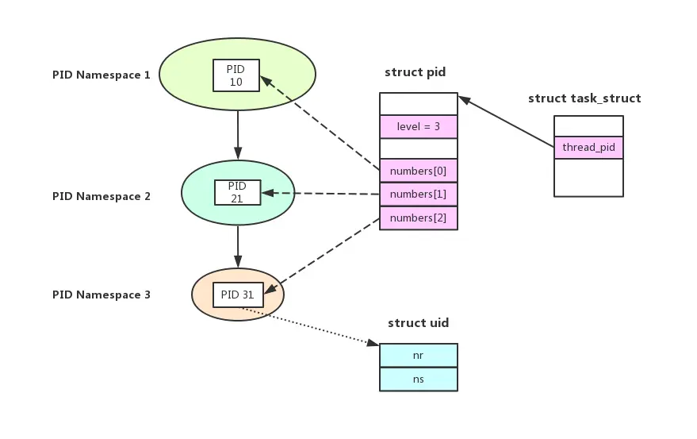
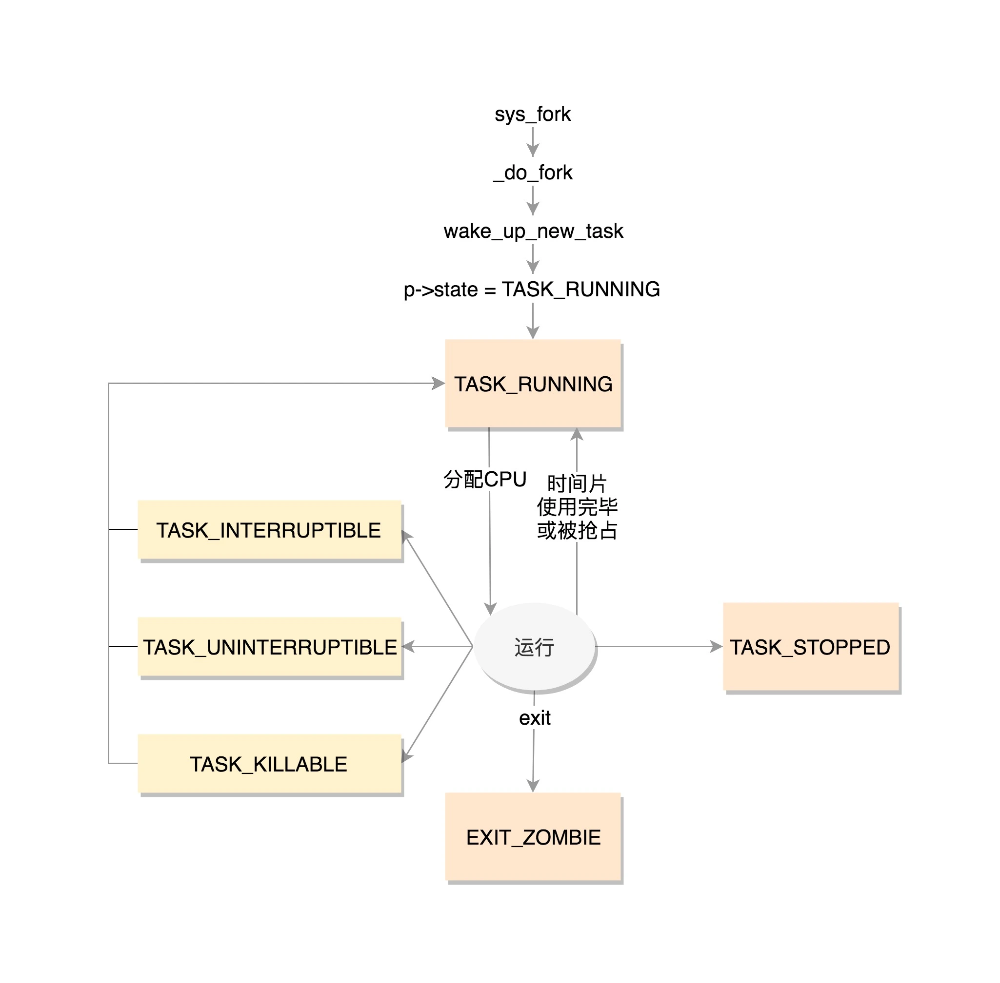
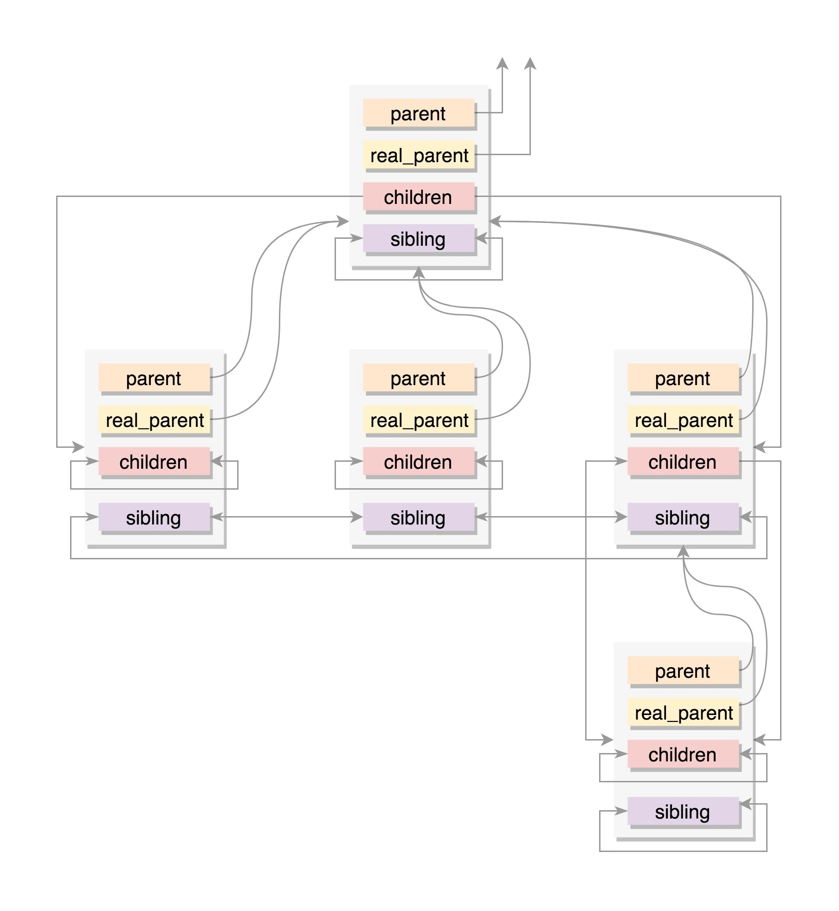

在Linux系统当中，严格来说并没有真正意义上的线程，Linux中的进程和线程都是一个task，每一个进程有独立的虚拟地址空间，分为用户虚拟地址空和内核虚拟地址空间。所有进程共享内核虚拟地址空间。
内核线程就是没有用户虚拟地址空间的进程，用户线程就是共享用户虚拟地址空间的进程。  
内核中进程的描述数据结构是一个结构体，称为进程描述符。所有的进程描述符都放到一个双向列表中，称为任务队列。进程描述符能够完整地描述一个正在执行的程序，包括它打开的文件、地址空间、信号、进程状态等等。我这里学习的内核代码版本是5.17，libc的版本是2.35。

# 进程描述符
对于Linux来说，一个进程对应内核和用户态两个空间，这里我们要重点弄懂task_struct、thread_info和stack这个三个数据结构及其对应关系。在内核中，很多关键的概念都是通过一个结构体来描述的。
linux-master\include\linux\sched.h中定义了task_struct结构体，这个结构体非常庞大，我们先了解一下常用的，


## 进程ID
我们知道一个进程可能有多个线程，通过系统调用接口可以获取每个线程的ID，ps进程可以查看进程ID，这个进程号是存到哪里的呢？在task_struct中有这几个成员，
```C++
pid_t                   pid;            //线程ID / 进程ID
pid_t                   tgid;           //线程组ID
struct task_struct      *group_leader;  //线程组主线程
```
我们通过ps或者top查看的进程号其实就是tgid，因为按照linux系统来看，进程其实就是一个线程组，包含了多个线程，其主线程id就是tgid。
线程组中每一个线程都可以通过自己结构中的group_leader找到主线程，在其成员中并没有ppid。
通过一个进程的task_struct可以简单的找到其pid，那如果知道pid，如果找到对应的task_struct呢？内核中使用了哈希表的方式。

## struct pid
在task_struct中有这样一个成员，
```C++
struct pid			*thread_pid;
```
为什么有了进程id以后，还需要这样一个成员呢？Linux Kernel为了实现资源隔离和虚拟化，引入了Namespace机制，比如docker就充分利用了Namespace机制。  
我们这里主要涉及到PID Namespace, 简单来讲就是可以创建多个pid相互隔离的namespace，其主要特征如下：  
（1）每个namespace里都有自己的1号init进程，来负责启动时初始化和接收孤儿进程；  
（2）不同namespace中的各进程pid可以相同；  
（3）namespace可以层级嵌套创建；下一级namespace中进程对其以上所有层的namespace都是可见的,同一个task在不同层级namespace中pid可以不同。  
namespace我目前还没接触过，所以暂时不是我学习的重点，主要是想了解一下struct pid结构，其定义在linux-master\include\linux\pid.h，
```C++
struct pid
{
	refcount_t count;           // 引用计数
	unsigned int level;         // pid namespace的层级
	spinlock_t lock;
	/* lists of tasks that use this pid */
	struct hlist_head tasks[PIDTYPE_MAX];
	struct hlist_head inodes;
	/* wait queue for pidfd notifications */
	wait_queue_head_t wait_pidfd;
	struct rcu_head rcu;
	struct upid numbers[1];     // 动态数组，0是global namespace
};

struct upid {
	int nr;                     // 当前namespace中的pid值
	struct pid_namespace *ns;   // 当前namespace
};
```

一个进程属于几个namespace 就有几个 upid, 因此采用变长数组，number[0] 表示最顶层的 namespacelevel=0, number[1]表示level=1, 以此类推。
当知道了某一个进程的pid后，实际上就是知道upid，然后反向查找得到pid，再通过pid反向得到task_struct，这里面的过程暂且不表，后续再深入了解一下。

## 进程状态
我们再背八股文的时候都背过进程的状态，再linux中进程的状态也是定义在task_struct中，__state是总体状态，exit_state是进程在死亡时的两个子状态。
```C++
unsigned int      __state;
int               exit_state;         //进程退出时状态

/* Used in tsk->state: */
#define TASK_RUNNING			0x0000
#define TASK_INTERRUPTIBLE		0x0001
#define TASK_UNINTERRUPTIBLE	0x0002
#define __TASK_STOPPED			0x0004
#define __TASK_TRACED			0x0008
/* Used in tsk->exit_state: */
#define EXIT_DEAD			0x0010
#define EXIT_ZOMBIE			0x0020
#define EXIT_TRACE			(EXIT_ZOMBIE | EXIT_DEAD)
/* Used in tsk->state again: */
#define TASK_PARKED			0x0040
#define TASK_DEAD			0x0080
#define TASK_WAKEKILL		0x0100
#define TASK_WAKING			0x0200
#define TASK_NOLOAD			0x0400
#define TASK_NEW			0x0800
/* Convenience macros for the sake of set_current_state: */
#define TASK_KILLABLE		(TASK_WAKEKILL | TASK_UNINTERRUPTIBLE)
#define TASK_TRACED			(TASK_WAKEKILL | __TASK_TRACED)
#define TASK_IDLE			(TASK_UNINTERRUPTIBLE | TASK_NOLOAD)
```
state的状态也定义在这个头文件中，通过bit的方式设置，  

TASK_RUNNING 并不是说进程正在运行，而是表示进程在时刻准备运行的状态。当处于这个状态的进程获得时间片的时候，就是在运行中；如果没有获得时间片，就说明它被其他进程抢占了，在等待再次分配时间片。  
在运行中的进程，一旦要进行一些 I/O 操作，需要等待 I/O 完毕，这个时候会释放 CPU，进入睡眠状态，在 Linux 中，有两种睡眠状态。
一种是 TASK_INTERRUPTIBLE，可中断的睡眠状态。这是一种浅睡眠的状态，也就是说，虽然在睡眠，等待 I/O 完成，但是这个时候一个信号来的时候，进程还是要被唤醒。只不过唤醒后，不是继续刚才的操作，而是进行信号处理。当然程序员可以根据自己的意愿，来写信号处理函数，例如收到某些信号，就放弃等待这个 I/O 操作完成，直接退出；或者收到某些信息，继续等待。  
另一种睡眠是 TASK_UNINTERRUPTIBLE，不可中断的睡眠状态。这是一种深度睡眠状态，不可被信号唤醒，只能死等 I/O 操作完成。一旦 I/O 操作因为特殊原因不能完成，这个时候，谁也叫不醒这个进程了。你可能会说，我 kill 它呢？别忘了，kill 本身也是一个信号，既然这个状态不可被信号唤醒，kill 信号也被忽略了。除非重启电脑，没有其他办法。因此，这其实是一个比较危险的事情，除非程序员极其有把握，不然还是不要设置成 TASK_UNINTERRUPTIBLE。  
于是，我们就有了一种新的进程睡眠状态，TASK_KILLABLE，可以终止的新睡眠状态。进程处于这种状态中，它的运行原理类似 TASK_UNINTERRUPTIBLE，只不过可以响应致命信号。从定义可以看出，TASK_WAKEKILL 用于在接收到致命信号时唤醒进程，而 TASK_KILLABLE 相当于这两位都设置了。  
TASK_STOPPED 是在进程接收到 SIGSTOP、SIGTTIN、SIGTSTP 或者 SIGTTOU 信号之后进入该状态。  
一旦一个进程要结束，先进入的是 EXIT_ZOMBIE 状态，但是这个时候它的父进程还没有使用 wait() 等系统调用来获知它的终止信息，此时进程就成了僵尸进程。进程发出退出信号后，还占有的内存包括内核栈、thread_info结构和task_struct结构。只有当父进程检索处理后，这些内存才会被释放。父进程在子进程之前退出，必须选择一个养父进程，如果找不到就选择init进程，它会例行调用wait来清楚僵尸进程。
EXIT_DEAD 是进程的最终状态。EXIT_ZOMBIE 和 EXIT_DEAD 也可以用于exit_state。  

## 进程运行统计信息

```C++
u64             utime;      	//用户态消耗的CPU时间
u64             stime;      	//内核态消耗的CPU时间
unsigned long   nvcsw;      	//自愿上下文切换次数
unsigned long   nivcsw;     	//非自愿上下文切换次数
u64             start_time; 	//进程启动时间，不包含睡眠时间
u64             start_boottime; //进程启动时间，包含睡眠时间
```

## 进程关系
任何一个进程都有父进程。所以，整个进程其实就是一棵进程树，而拥有同一父进程的所有进程都具有兄弟关系。  
```C++
struct task_struct __rcu    *real_parent;   //父进程
struct task_struct __rcu    *parent;           
struct list_head            children;   	//子进程
struct list_head            sibling;    	//兄弟进程
```


## 进程权限
进程权限有两个成员，一个表示被操作的权限，一个表示能够操作的权限。
```C++
/* Objective and real subjective task credentials (COW): */
const struct cred __rcu		*real_cred;
/* Effective (overridable) subjective task credentials (COW): */
const struct cred __rcu		*cred;
```
权限结构体定义在linux-master\include\linux\cred.h
```C++
struct cred {
......
	kuid_t		uid;		/* real UID of the task */
	kgid_t		gid;		/* real GID of the task */
	kuid_t		suid;		/* saved UID of the task */
	kgid_t		sgid;		/* saved GID of the task */
	kuid_t		euid;		/* effective UID of the task */
	kgid_t		egid;		/* effective GID of the task */
	kuid_t		fsuid;		/* UID for VFS ops */
	kgid_t		fsgid;		/* GID for VFS ops */
	unsigned	securebits;	/* SUID-less security management */
	kernel_cap_t	cap_inheritable; /* caps our children can inherit */
	kernel_cap_t	cap_permitted;	/* caps we're permitted */
	kernel_cap_t	cap_effective;	/* caps we can actually use */
	kernel_cap_t	cap_bset;	/* capability bounding set */
	kernel_cap_t	cap_ambient;	/* Ambient capability set */
#ifdef CONFIG_KEYS
	unsigned char	jit_keyring;	/* default keyring to attach requested
					 * keys to */
	struct key	*session_keyring; /* keyring inherited over fork */
	struct key	*process_keyring; /* keyring private to this process */
	struct key	*thread_keyring; /* keyring private to this thread */
	struct key	*request_key_auth; /* assumed request_key authority */
......
} __randomize_layout;
```
第一个是 uid 和 gid，注释是 real user/group id。一般情况下，谁启动的进程，就是谁的 ID。但是权限审核的时候，往往不比较这两个，也就是说不大起作用。  
第二个是 euid 和 egid，注释是 effective user/group id。一看这个名字，就知道这个是起“作用”的。当这个进程要操作消息队列、共享内存、信号量等对象的时候，其实就是在比较这个用户和组是否有权限。  
第三个是 fsuid 和 fsgid，也就是 filesystem user/group id。这个是对文件操作会审核的权限。  
一般说来，fsuid、euid，和 uid 是一样的，fsgid、egid，和 gid 也是一样的。因为谁启动的进程，就应该审核启动的用户到底有没有这个权限。  
我们经常碰到这种情况，进程文件的拥有者和执行者不是一个权限。比如进程文件是root的，但是执行者不是root，此时如果我们往一个root用户采用权限写入的目录写入，就写入不了。但是我们可以设置set-user-id来改变权限，也就是chown u+s ， 此时进程运行时就具有了进程文件所有者的权限，euid 和 fsuid就会变成root，但是uid不是root。

另外还有内存管理和文件管理的成员，这个留待后面学习内存管理和文件管理时再看。
