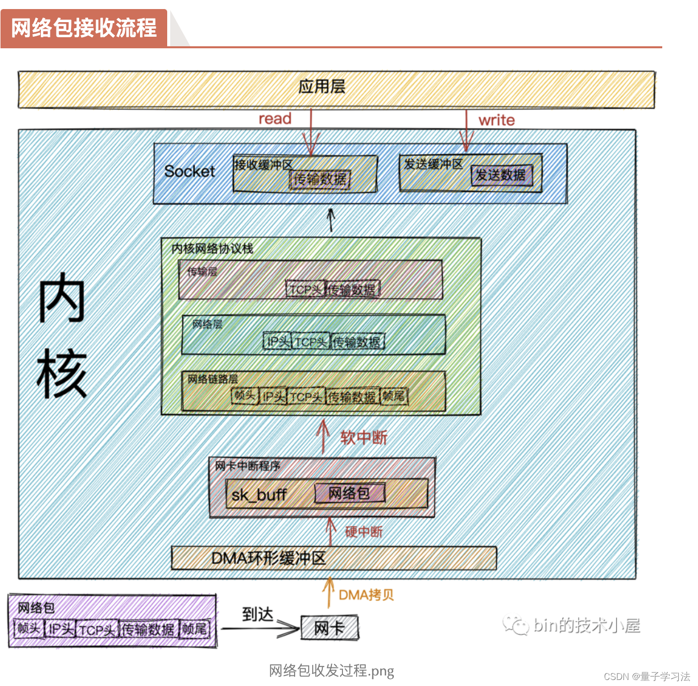

# linux网络收包过程概览
linux内核以及网卡驱动主要是实现链路层、网络层和传输层的功能。
内核和网络涉笔驱动是通过中断来处理数据，但是为了避免中断处理函数过度占用CPU，所以内核的中断处理函数分成了上下部分，上半部分是硬中断，只进行简单的动作，下半部分交给软中断处理。硬中断时通过给CPU物理引脚施加电压变化实现的，而软中断则是软件层面给一个内存值赋予标记来实现的。

1、当网卡收到数据以后，以DMA的方式将收到的帧写到内存里，这个内存区域就是RingBuffer，是网卡在启动的时候分配和初始化的环形队列。
    ------问题点1 ： RingBuffer到低是什么，DMA是怎么写到RingBuffer的，如果创建和初始化的，大小是什么，满了怎么办？
2、DMA操作完成后网卡触发硬中断，告诉CPU有网络数据到达，CPU会调用网卡驱动注册的硬中断处理函数，硬中断不会进行过多操作，而是发出软中断请求
    ------问题点2 ： 硬中断到低干了什么，是否会处理网络数据？
3、内核线程ksoftirqd检测到有软中断请求到达，调用网卡驱动注册的poll函数，将网络包交给各级协议栈处理。
    ------问题点3 ： 软中断到低干了什么，怎么拿到RingBuffer的网卡数据的，又是如何处理的？
    ------问题点4 ： 软中断处理完以后数据怎么到达应用层的socket


## 处理网络包的软中断线程初始化过程
使用ps -ef | grep soft能够看到软中断处理线程，每个CPU核心都会对应一个ksoftirqd线程。
root          13       2  0 7月10 ?       00:00:20 [ksoftirqd/0]
我们知道，start_kernel是内核的启动函数，而各个模块的init调用不是简单的接口调用，而是通过将函数放入特定的段来完成的，在kernel\softirq.c中可以看到spawn_ksoftirqd的定义，
```c++
static struct smp_hotplug_thread softirq_threads = {
	.store			= &ksoftirqd,       // 软中断内核线程对应的task_struct
	.thread_should_run	= ksoftirqd_should_run, // 检查线程是否应该运行的回调函数
	.thread_fn		= run_ksoftirqd,            // 回调函数
	.thread_comm		= "ksoftirqd/%u",
};
static __init int spawn_ksoftirqd(void)
{
	cpuhp_setup_state_nocalls(CPUHP_SOFTIRQ_DEAD, "softirq:dead", NULL,
				  takeover_tasklets);
	BUG_ON(smpboot_register_percpu_thread(&softirq_threads));

	return 0;
}
early_initcall(spawn_ksoftirqd);
```
这里early_initcall可以简单理解为注册了spawn_ksoftirqd这个初始化函数，start_kernel中就会调用到它。这里的cpuhp_setup_state_nocalls是与内核CPU热插拔香瓜你的，暂且不必关注，BUG_ON是一个类似断言的宏，当条件为true是会触发系统崩溃。
实际会调用smpboot_register_percpu_thread这个接口，传递的参数就是smp_hotplug_thread这个结构体
smpboot_register_percpu_thread -->
     __smpboot_create_thread -->
        kthread_create_on_cpu
    
kthread_create_on_cpu传入的线程函数是smpboot_thread_fn，这个线程函数中会根据上面的ksoftirqd_should_run来判断是否运行run_ksoftirqd。当有软中断需要处理时，回调函数就会运行。

```c++
static int ksoftirqd_should_run(unsigned int cpu)
{
	return local_softirq_pending();
}

static void run_ksoftirqd(unsigned int cpu)
{
	ksoftirqd_run_begin();
	if (local_softirq_pending()) {
		/*
		 * We can safely run softirq on inline stack, as we are not deep
		 * in the task stack here.
		 */
		__do_softirq();
		ksoftirqd_run_end();
		cond_resched();
		return;
	}
	ksoftirqd_run_end();
}
```
在软中断处理的时候会先调用ksoftirqd_run_begin --> local_irq_disable，关闭硬中断，也就是说此时就算有新的网络包到达，也不会再次出发硬中断。
内核中的软中断可不止网络中断，还有很多类型。就像每一个系统调用号都有对应的内核处理函数，软中断也是根据中断类型来选择对应的中断处理函数运行的，接下来我们将在网络模块的初始化中看到中断处理函数事如何注册的。
```c++
enum
{
	HI_SOFTIRQ=0,
	TIMER_SOFTIRQ,
	NET_TX_SOFTIRQ,
	NET_RX_SOFTIRQ,
	BLOCK_SOFTIRQ,
	IRQ_POLL_SOFTIRQ,
	TASKLET_SOFTIRQ,
	SCHED_SOFTIRQ,
	HRTIMER_SOFTIRQ,
	RCU_SOFTIRQ,    /* Preferable RCU should always be the last softirq */

	NR_SOFTIRQS
};
```

## 网络模块的初始化
网络模块的初始化函数是net_dev_init，定义在net\core\dev.c，我们可以看到类似的init注册，内核使用subsys_initcall完成各个子系统的初始化。
subsys_initcall(net_dev_init);
```c++
static int __init net_dev_init(void)
{
    ......
	for_each_possible_cpu(i) {
		struct work_struct *flush = per_cpu_ptr(&flush_works, i);
		struct softnet_data *sd = &per_cpu(softnet_data, i);

		INIT_WORK(flush, flush_backlog);

		skb_queue_head_init(&sd->input_pkt_queue);
		skb_queue_head_init(&sd->process_queue);

		INIT_LIST_HEAD(&sd->poll_list);
		......
	}

    ......
	open_softirq(NET_TX_SOFTIRQ, net_tx_action);
	open_softirq(NET_RX_SOFTIRQ, net_rx_action);

	......
}
```

在 net_dev_init 函数中，会执行以下关键步骤：
（1）初始化 CPU 相关的数据结构：为每个 CPU 分配并初始化 softnet_data 结构体，这些结构体用于存储与每个 CPU 相关的网络数据处理信息。
```c++
    struct softnet_data *sd = &per_cpu(softnet_data, i);

    struct softnet_data {
	    struct list_head	poll_list;
    ......
```
    softnet_data 是一个与网络设备接收处理紧密相关的数据结构，它用于存储和管理与每个CPU相关的网络接收队列和状态信息。而其中的 poll_list 则是 一个内核中常见的双向链表声明。

（2）注册软中断：使用 open_softirq 函数注册网络发送和接收的软中断处理函数。这些函数将在软中断发生时被调用，以处理网络数据的发送和接收。
```C++
	open_softirq(NET_TX_SOFTIRQ, net_tx_action);
	open_softirq(NET_RX_SOFTIRQ, net_rx_action);

    void open_softirq(int nr, void (*action)(struct softirq_action *))
    {
        softirq_vec[nr].action = action;
    }

```
    分别为tx和rx注册了软中断处理函数，注册的过程其实就是爆粗拿到softirq_vec这个变量里面，软中断线程运行的逻辑就是根据这个数组来找到对应的中断处理函数。

## 协议栈的注册
内核实现了网络层的ip协议，也实现了传输层的tcp和udp协议，inet_init定义在net\ipv4\af_inet.c，内核通过fs_initcall调用inet_init后开始网络协议栈的注册。
```C++
static int __init inet_init(void)
{
	struct inet_protosw *q;
	struct list_head *r;
	int rc;
    ......
	rc = proto_register(&tcp_prot, 1);
    ......

	rc = proto_register(&udp_prot, 1);
    ......

	rc = proto_register(&raw_prot, 1);
    ......

	rc = proto_register(&ping_prot, 1);
    ......

	(void)sock_register(&inet_family_ops);

	/*
	 *	Add all the base protocols.
	 */
	if (inet_add_protocol(&icmp_protocol, IPPROTO_ICMP) < 0)
		pr_crit("%s: Cannot add ICMP protocol\n", __func__);
	if (inet_add_protocol(&udp_protocol, IPPROTO_UDP) < 0)
		pr_crit("%s: Cannot add UDP protocol\n", __func__);
	if (inet_add_protocol(&tcp_protocol, IPPROTO_TCP) < 0)
		pr_crit("%s: Cannot add TCP protocol\n", __func__);
#ifdef CONFIG_IP_MULTICAST
	if (inet_add_protocol(&igmp_protocol, IPPROTO_IGMP) < 0)
		pr_crit("%s: Cannot add IGMP protocol\n", __func__);
#endif


	arp_init();
	ip_init();
	/* Initialise per-cpu ipv4 mibs */
	if (init_ipv4_mibs())
		panic("%s: Cannot init ipv4 mibs\n", __func__);
	/* Setup TCP slab cache for open requests. */
	tcp_init();
	/* Setup UDP memory threshold */
	udp_init();
	/* Add UDP-Lite (RFC 3828) */
	udplite4_register();
	raw_init();
	ping_init();
	ipv4_proc_init();
	ipfrag_init();
	dev_add_pack(&ip_packet_type);
	ip_tunnel_core_init();
    ......
}
```

proto_register 函数的主要作用是将一个网络协议的数据结构（通常是 struct proto 类型的结构体）注册到内核的全局协议链表中。
inet_add_protocol 函数的作用则是将特定的Internet协议（如TCP、UDP、ICMP等）添加到内核的INET协议处理表中。INET协议处理表是内核中用于处理IPv4数据包的一个关键数据结构。
这两个函数的具体功能差别暂时不知道，这里先重点关注的是inet_add_protocol
```C++
int inet_add_protocol(const struct net_protocol *prot, unsigned char protocol)
{
	return !cmpxchg((const struct net_protocol **)&inet_protos[protocol],
			NULL, prot) ? 0 : -1;
}

static struct net_protocol udp_protocol = {
	.early_demux =	udp_v4_early_demux,
	.early_demux_handler =	udp_v4_early_demux,
	.handler =	udp_rcv,
	.err_handler =	udp_err,
	.no_policy =	1,
};
static struct net_protocol tcp_protocol = {
	.early_demux	=	tcp_v4_early_demux,
	.early_demux_handler =  tcp_v4_early_demux,
	.handler	=	tcp_v4_rcv,
	.err_handler	=	tcp_v4_err,
	.no_policy	=	1,
	.icmp_strict_tag_validation = 1,
};

static struct packet_type ip_packet_type __read_mostly = {
	.type = cpu_to_be16(ETH_P_IP),
	.func = ip_rcv,
	.list_func = ip_list_rcv,
};
```
将TCP和UDP的处理结构注册到inet_protos数组中，而上面inet_init最后的dev_add_pack(&ip_packet_type)则是注册到ptype_base哈希表中。
所以这里的核心逻辑是，ptye_base存储着ip_rcv这个处理函数，后面会看到软中断会通过ptye_base找到这个函数，将ip包交给它处理。而inet_protos记录者udp和tcp的处理函数地址，ip_rcv这个函数
就会通过inet_protos找到tcp或者udp的处理函数，将包转发给tcp_v4_rcv或者udp_rcv。


## 网卡驱动的初始化
每一个驱动程序都会通过module_init向内核注册初始化函数。以igb网卡为例，drivers\net\ethernet\intel\igb\igb_main.c，可以看到module_init(igb_init_module)的声明，说明其初始化函数是igb_init_module。
```C++
static int __init igb_init_module(void)
{
	int ret;
    ......
	ret = pci_register_driver(&igb_driver);
	return ret;
}

static struct pci_driver igb_driver = {
	.name     = igb_driver_name,
	.id_table = igb_pci_tbl,
	.probe    = igb_probe,
	.remove   = igb_remove,
#ifdef CONFIG_PM
	.driver.pm = &igb_pm_ops,
#endif
	.shutdown = igb_shutdown,
	.sriov_configure = igb_pci_sriov_configure,
	.err_handler = &igb_err_handler
};


static const struct net_device_ops igb_netdev_ops = {
	.ndo_open		= igb_open,
	.ndo_stop		= igb_close,
	.ndo_start_xmit		= igb_xmit_frame,
	.ndo_get_stats64	= igb_get_stats64,
	.ndo_set_rx_mode	= igb_set_rx_mode,
	.ndo_set_mac_address	= igb_set_mac,
	.ndo_change_mtu		= igb_change_mtu,
	.ndo_eth_ioctl		= igb_ioctl,
	.ndo_tx_timeout		= igb_tx_timeout,
	.ndo_validate_addr	= eth_validate_addr,
	.ndo_vlan_rx_add_vid	= igb_vlan_rx_add_vid,
	.ndo_vlan_rx_kill_vid	= igb_vlan_rx_kill_vid,
	.ndo_set_vf_mac		= igb_ndo_set_vf_mac,
	.ndo_set_vf_vlan	= igb_ndo_set_vf_vlan,
	.ndo_set_vf_rate	= igb_ndo_set_vf_bw,
	.ndo_set_vf_spoofchk	= igb_ndo_set_vf_spoofchk,
	.ndo_set_vf_trust	= igb_ndo_set_vf_trust,
	.ndo_get_vf_config	= igb_ndo_get_vf_config,
	.ndo_fix_features	= igb_fix_features,
	.ndo_set_features	= igb_set_features,
	.ndo_fdb_add		= igb_ndo_fdb_add,
	.ndo_features_check	= igb_features_check,
	.ndo_setup_tc		= igb_setup_tc,
	.ndo_bpf		= igb_xdp,
	.ndo_xdp_xmit		= igb_xdp_xmit,
};
```
pci_register_driver 是一个在Linux内核中用于注册PCI（Peripheral Component Interconnect，外设组件互连）设备驱动程序的函数。当开发者编写了一个PCI设备的驱动程序后，他们需要使用这个函数来将该驱动程序注册到内核中，以便内核能够识别和管理与该驱动程序关联的PCI设备。
这里注册的就是igb_driver，当它运行完以后，内核就知道了这个驱动相关的信息。当内核检测到新的PCI设备或热插拔事件时，它会遍历已注册的驱动程序，寻找与设备相匹配的驱动。如果找到匹配的igb驱动，则会调用 igb_probe 函数。
初始化操作：在 igb_probe 函数内部，会执行一系列初始化操作，
1. DMA初始化
2. 注册ethtool实现函数，ethtool能够设置网卡的参数就是因为它最终调用了网卡驱动对应的方法
3. 注册netdev等变量
4. NAPI初始化，注册poll函数
igb_probe中有一行注册调用，
err = register_netdev(netdev);
其中netdev->netdev_ops = &igb_netdev_ops;
而igb_netdev_ops中包含了igb_open函数，会在网卡启动的时候被调用。

## 网卡启动
当网卡驱动初始化以后，就可以启动网卡了，上面注册的igb_netdev_ops包含了网卡启动、发包、设置mac地址等回调函数。当启用一个网卡时，先调用struct net_device_ops的ndo_open成员，也就是igb_open，它会完成以下动作，
1、分配和初始化RingBuffer，它包括tx和rx
2、注册硬中断处理函数
3、启用NAPI，启用硬中断，并通过schedule_work启动设备看门狗

```C++
static int __igb_open(struct net_device *netdev, bool resuming)
{
    // 获取网卡私有数据成员
    struct igb_adapter *adapter = netdev_priv(netdev);
	struct e1000_hw *hw = &adapter->hw;
	struct pci_dev *pdev = adapter->pdev;
    ......
	/* allocate transmit descriptors */
	err = igb_setup_all_tx_resources(adapter);
    ......
	/* allocate receive descriptors */
	err = igb_setup_all_rx_resources(adapter);
	......
	err = igb_request_irq(adapter);
	......
	for (i = 0; i < adapter->num_q_vectors; i++)
		napi_enable(&(adapter->q_vector[i]->napi));

	......
	igb_irq_enable(adapter);

    ......
	/* start the watchdog. */
	hw->mac.get_link_status = 1;
	schedule_work(&adapter->watchdog_task);

	return 0;
}
```
这里我们重点关注一下RingBuffer的创建过程。需要明确的是RingBuffer和Rx队列的区别，具体来说RingBuffer是具体的数据结构，也就是实现Rx队列的方式。RX队列不仅仅是一个存储空间，它还包含了与数据包接收和处理相关的逻辑和机制，如中断处理、数据包校验、流量控制等。
```C++
static int igb_setup_all_rx_resources(struct igb_adapter *adapter)
{
	struct pci_dev *pdev = adapter->pdev;
	int i, err = 0;
	
	for (i = 0; i < adapter->num_rx_queues; i++) {
		err = igb_setup_rx_resources(adapter->rx_ring[i]);
		if (err) {
			dev_err(&pdev->dev,
				"Allocation for Rx Queue %u failed\n", i);
			for (i--; i >= 0; i--)
				igb_free_rx_resources(adapter->rx_ring[i]);
			break;
		}
	}

	return err;
}
```
首先我们可以看到ringbuffer不是一个，而是根据num_rx_queues来决定的，这是根据网卡多队列来开启的，ringbuffer的创建在igb_setup_rx_resources中。
```C++
int igb_setup_rx_resources(struct igb_ring *rx_ring)
{
	struct igb_adapter *adapter = netdev_priv(rx_ring->netdev);
	struct device *dev = rx_ring->dev;
	int size;
	// 申请ringbuffer大小所需要的内存，注意到每一个节点的数据结构体是 struct igb_rx_buffer
	size = sizeof(struct igb_rx_buffer) * rx_ring->count;
	rx_ring->rx_buffer_info = vmalloc(size);
	if (!rx_ring->rx_buffer_info)
		goto err;

	/* Round up to nearest 4K */
	// 申请rx_ring->size的dma内存，注意数据结构体是union e1000_adv_rx_desc
	rx_ring->size = rx_ring->count * sizeof(union e1000_adv_rx_desc);
	rx_ring->size = ALIGN(rx_ring->size, 4096);
	rx_ring->desc = dma_alloc_coherent(dev, rx_ring->size,
					   &rx_ring->dma, GFP_KERNEL);
	if (!rx_ring->desc)
		goto err;

	// 初始化队列成员
	rx_ring->next_to_alloc = 0;
	rx_ring->next_to_clean = 0;
	rx_ring->next_to_use = 0;

	rx_ring->xdp_prog = adapter->xdp_prog;
    ......
	return 0;

err:
	vfree(rx_ring->rx_buffer_info);
	rx_ring->rx_buffer_info = NULL;
	dev_err(dev, "Unable to allocate memory for the Rx descriptor ring\n");
	return -ENOMEM;
}
```
当内存申请完以后，在一个igb_ring结构中，其中两个成员rx_buffer_info和desc都是ringbuffer，而后者是dma内存，才是网卡负责写入用的。
之后，网卡会注册硬中断，igb_request_irq, 调用顺序为igb_request_irq->igb_request_msix->request_irq
igb_request_msix中会为多队列的网卡每一个队列都注册中断，中段处理函数是igb_msix_ring
注意num_q_vectors关注的是中断向量的数量，而num_rx_queues关注的是接收队列的数量。虽然它们之间有一定的关联（例如，每个接收队列可能对应一个中断向量），但它们的数量并不总是相等的。具体配置取决于网络设备的硬件设计和性能需求。
硬中断中的处理逻辑十分简单，
```C++
static irqreturn_t igb_msix_ring(int irq, void *data)
{
	struct igb_q_vector *q_vector = data;

	/* Write the ITR value calculated from the previous interrupt. */
	igb_write_itr(q_vector);

	napi_schedule(&q_vector->napi);

	return IRQ_HANDLED;
}
```
主要执行两个操作：
一是通过igb_write_itr记录硬中断的次数（这是一个简单的累加过程）；
二是调用napi_schedule函数，该函数将网卡的polling方法添加到CPU的softnet_data变量中，以便后续通过软中断进行处理。
napi_schedule函数最终会触发一个软中断（NET_RX_SOFTIRQ），同时，将napi_struct添加到对应CPU的softnet_data中的poll_list。这使得CPU可以在稍后的时间点，以较低的优先级处理网络数据包，从而避免在硬中断上下文中进行过多的处理，提高了系统的响应能力和效率。
napi_schedule->__napi_schedule->____napi_schedule->list_add_tail(&napi->poll_list, &sd->poll_list), __raise_softirq_irqoff(NET_RX_SOFTIRQ)


## 网卡数据接收
1、硬中断处理
	数据帧到达网卡的接受队列，网卡通过dma将数据存到对应的ringbuffer内存中，当dma完成以后，网卡会向CPU发起一个硬中断，告知CPU有数据到达。CPU响应，硬中断，通过硬中断处理函数最终调用到napi_schedule，并记录软中断。
	可以看到，硬中断就只是修改了一下CPU的poll_list，这个里面记录的都是带有输入帧需要被处理的设备，然后发出软中断。
	